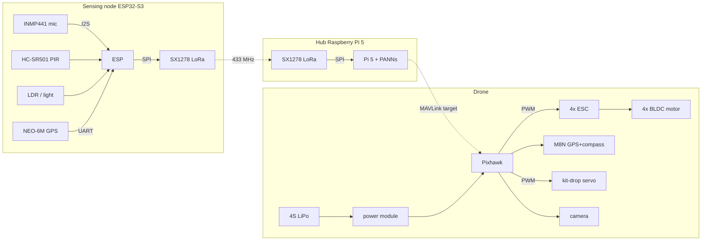

# VanniKawachh -- exact hardware wiring (build reference)

This is the real circuit: the exact components and pin-by-pin connections for the
three units. Every bus here (I2S, SPI, UART, PWM/MAVLink) is a standard, mature
interface with well-supported libraries, which is why this assembles and works.

Validation split (what proves each part):
* **Boards + wiring** -> this document + a KiCad/EasyEDA schematic.
* **Drone flight** -> ArduPilot SITL (already runs the real Pixhawk firmware).
* **The CNN on the chip** -> Edge Impulse on the ESP32-S3.

---

## Unit 1 -- Sensing node (ESP32-S3)

**Bill of parts:** ESP32-S3-DevKitC-1, INMP441 I2S MEMS mic, HC-SR501 PIR,
photoresistor (LDR) + 10 k resistor, u-blox NEO-6M GPS, SX1278 (Ra-02) LoRa
433 MHz + spring/IPEX antenna, TP4056 charger, 18650 cell + holder, MT3608 boost
(for the 5 V rail), status LED + 220 ohm.

**INMP441 microphone (I2S):**
| INMP441 | ESP32-S3 |
|---|---|
| VDD | 3V3 |
| GND | GND |
| SCK (BCLK) | GPIO4 |
| WS (LRCLK) | GPIO5 |
| SD (data) | GPIO6 |
| L/R | GND (left channel) |

**SX1278 LoRa (SPI):**
| SX1278 | ESP32-S3 |
|---|---|
| VCC | 3V3 |
| GND | GND |
| SCK | GPIO12 |
| MISO | GPIO13 |
| MOSI | GPIO11 |
| NSS (CS) | GPIO10 |
| RST | GPIO9 |
| DIO0 | GPIO8 |

**NEO-6M GPS (UART):**
| NEO-6M | ESP32-S3 |
|---|---|
| VCC | 5V |
| GND | GND |
| TX | GPIO18 (ESP RX) |
| RX | GPIO17 (ESP TX) |

**Other:**
| Part | ESP32-S3 | Notes |
|---|---|---|
| HC-SR501 PIR OUT | GPIO15 | VCC 5V, GND |
| LDR divider | GPIO1 (ADC) | LDR to 3V3, 10 k to GND, junction to GPIO1 |
| Status LED | GPIO2 | + 220 ohm to GND |

**Power:** 18650 -> TP4056 (charge/protect) -> 3V3 LDO feeds ESP32-S3 + mic +
LoRa; MT3608 boost makes 5 V for the PIR + GPS. Antenna is mandatory on the
SX1278 (never power it without one).

Pins are the firmware defaults and are all reassignable in `firmware/node/`.

---

## Unit 2 -- Hub (Raspberry Pi 5)

**Bill of parts:** Raspberry Pi 5 (4 GB+), 27 W USB-C supply (or power bank),
microSD 32 GB, active cooler, SX1278 LoRa module, short antenna.

**SX1278 LoRa on the Pi SPI0:**
| SX1278 | Pi 5 (BCM) | Pin |
|---|---|---|
| VCC | 3V3 | 1 |
| GND | GND | 6 |
| SCK | GPIO11 (SCLK) | 23 |
| MISO | GPIO9 | 21 |
| MOSI | GPIO10 | 19 |
| NSS | GPIO8 (CE0) | 24 |
| RST | GPIO25 | 22 |
| DIO0 | GPIO4 | 7 |

The Pi runs the hub service (Stage-2 PANNs verify + fusion + dispatch) and sends
the target to the drone over MAVLink (USB or a telemetry radio).

---

## Unit 3 -- Drone

**Bill of parts:** F450 quad frame, Pixhawk 6C (or 2.4.8), 4x 2212 920KV BLDC
motor, 4x 30 A ESC (SimonK/BLHeli), PM07 power module, 4S 3300-5200 mAh LiPo,
M8N GPS+compass, SiK 433 MHz telemetry radio, MG996R (or SG90) kit-drop servo,
FPV/Pi camera, 1045 props, XT60 leads.

**Motors / ESCs (the propulsion):**
| From | To |
|---|---|
| ESC 1-4 signal | Pixhawk MAIN OUT 1-4 |
| ESC 1-4 power (+/-) | PM07 power module rails |
| Each ESC 3-phase out | its BLDC motor |
| PM07 battery in | 4S LiPo via XT60 |
| PM07 -> Pixhawk POWER1 | 6-pin cable (voltage/current + 5 V) |

**Pixhawk peripherals:**
| Peripheral | Pixhawk port |
|---|---|
| M8N GPS + compass | GPS1 (UART) + I2C |
| SiK telemetry radio | TELEM1 |
| Companion link (Pi/ESP MAVLink) | TELEM2 |
| Kit-drop servo signal | AUX1 (servo rail) |
| Servo 5 V (BEC) | AUX rail + from ESC BEC / separate UBEC |
| Camera | AUX2 trigger / powered from 5 V |

**How the kit drops:** the hub sends the target; ArduPilot flies the mission
(`docs/config/vannikawachh.param` sets the frame + failsafes); at the drop point
the mission issues `DO_SET_SERVO` on AUX1 -> the servo releases the first-aid kit.
This is exactly what the SITL demo already does.

**Power:** 4S LiPo -> PM07 -> Pixhawk + ESCs. Servo and companion get 5 V from a
UBEC (do not power a big servo off the Pixhawk rail directly).

---

## Why this will work when you build it

* **I2S** (mic), **SPI** (LoRa), **UART** (GPS + MAVLink), **PWM** (ESC + servo)
  are the four standard buses; every module above is a common breakout with a
  proven driver. Nothing here is exotic.
* The **flight code already flies in ArduPilot SITL** -- the same firmware runs
  on the real Pixhawk, so the drone behaviour is validated before you buy it.
* The **hub pipeline** (detect -> verify -> dispatch) already runs end to end on
  real audio in software.
* The only genuinely new bench work is: the INMP441 audio capture + on-device
  CNN latency (validate with Edge Impulse), and the SX1278 LoRa range (a field
  measurement). Everything else is assembly.

## Turn this into an editable schematic (optional)

To hand the committee a formal schematic/PCB: open **EasyEDA** (free, browser)
or **KiCad**, drop the parts above from the standard libraries, and wire them per
these tables. EasyEDA -> JLCPCB also gives a board fabrication quote (a hard
number for the budget).
