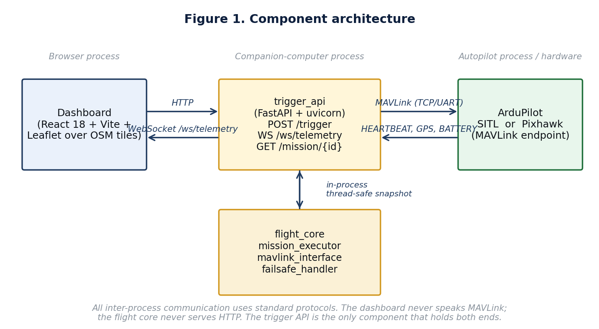
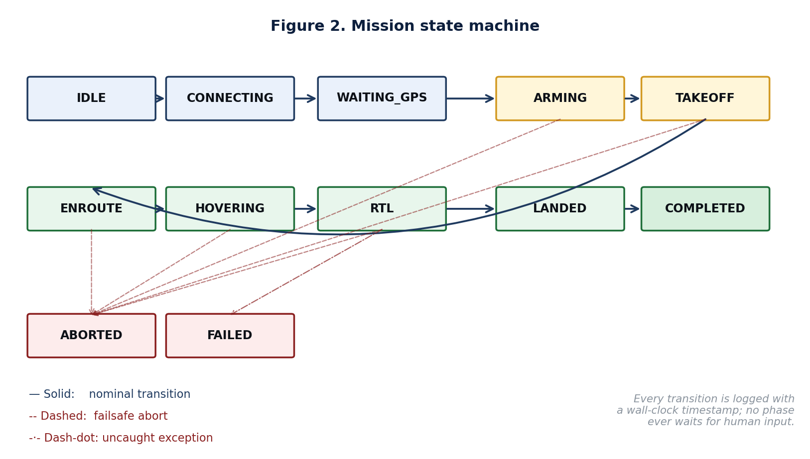
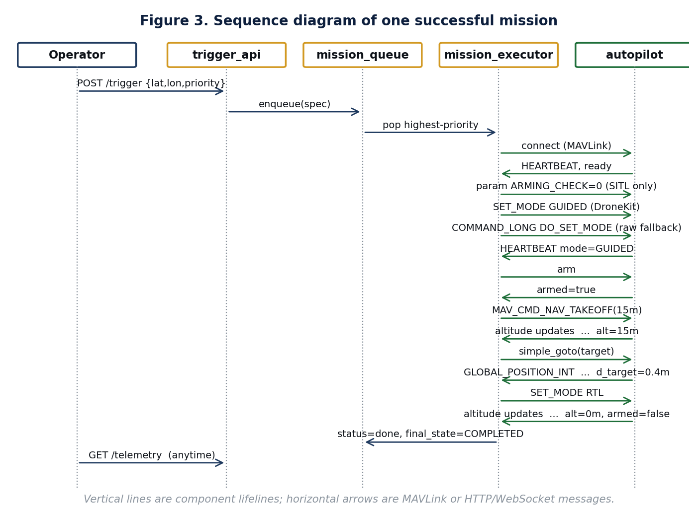
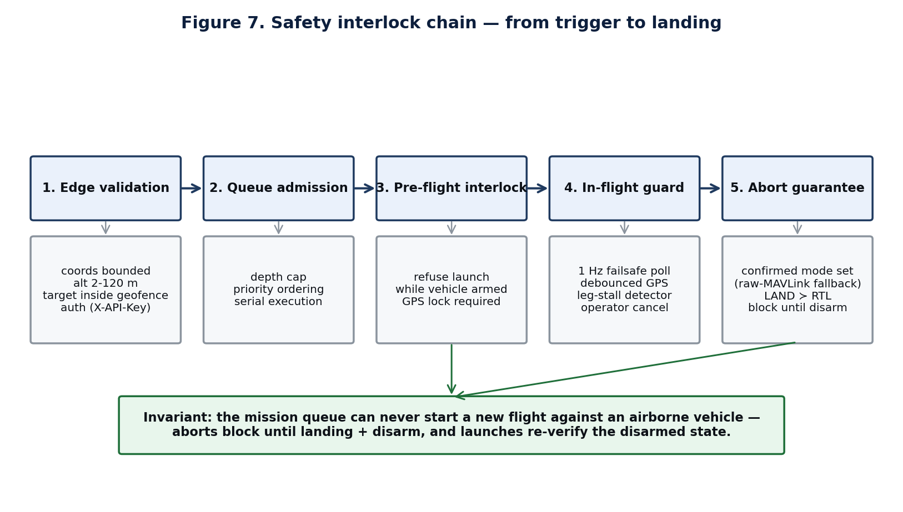
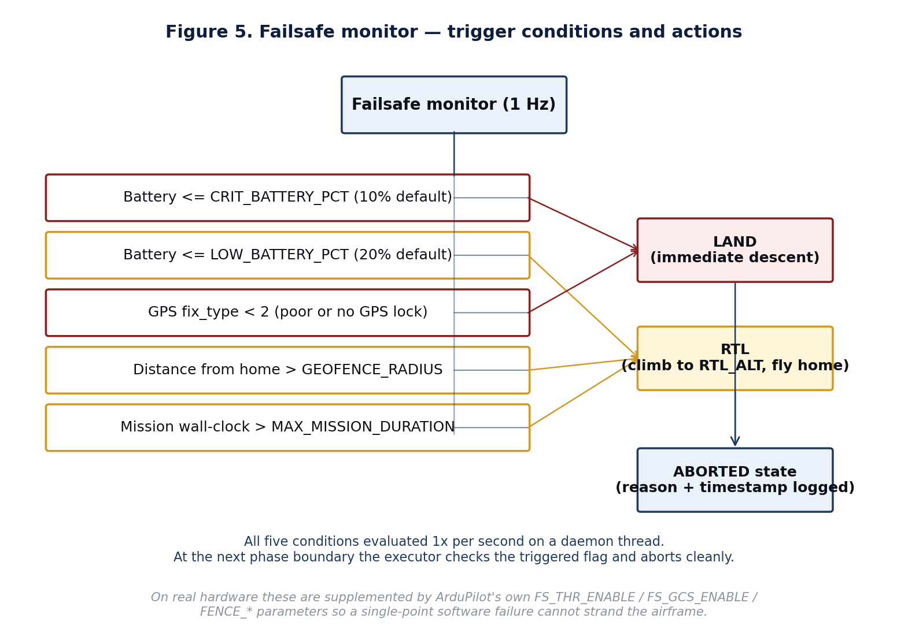
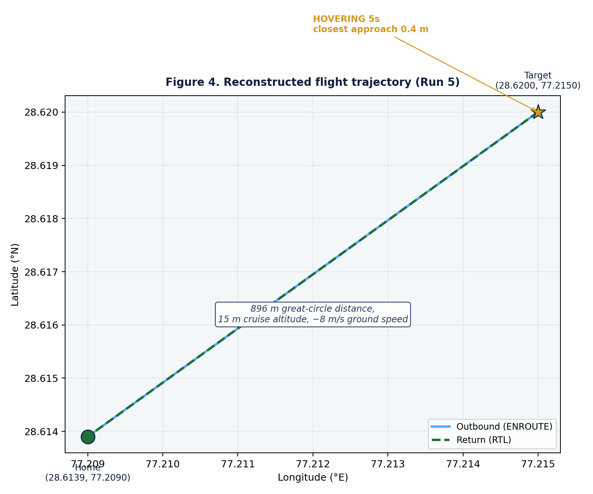
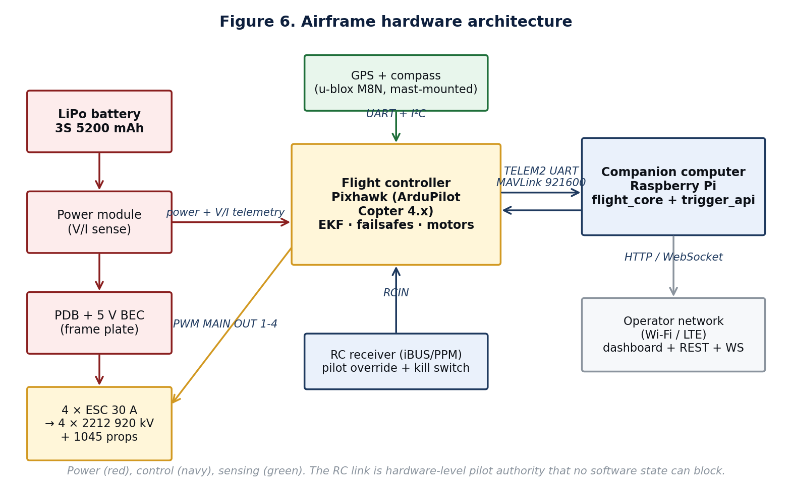

# A Safety-Interlocked, Trigger-Driven Architecture for Fully Autonomous UAV Dispatch with Verified Command Delivery

**Author:** *(to be filled in)*
**Affiliation:** *(to be filled in)*
**Repository:** <https://github.com/SV-1411/drone.git>
**Date:** 2026-06-11
**Status:** Pre-print, open-source release (v2 — supersedes the 2026-06-06 draft)

---

## Abstract

Autonomous response to external events — a sensor alarm, an emergency call,
an inspection schedule — requires an unmanned aerial vehicle (UAV) to fly
from its base to a designated coordinate with no human piloting. The
under-examined failure class in such systems is not navigation but
*command delivery*: autopilot firmware can silently reject or drop the very
mode-change commands that implement an emergency response, and a dispatch
service that trusts a single command transmission can strand an airborne
aircraft. This paper presents a complete, open-source dispatch architecture
built around three safety mechanisms implemented in the companion-computer
layer above the ArduPilot autopilot [1]: (i) a **verified mode-transition
protocol** that issues a flight-mode change through a high-level API, then
re-issues it through two raw MAVLink [2] encodings on a sub-second cadence
until the autopilot's HEARTBEAT stream confirms adoption; (ii) a
**landing-interlocked mission queue** in which any abort path blocks until
the airframe has demonstrably landed and disarmed, and a new mission
refuses to launch against an armed vehicle; and (iii) a **debounced,
severity-ordered failsafe arbiter** in which a LAND demand is never
downgraded, single-sample sensor glitches cannot trigger a landing, and
escalation is honoured even mid-return. The system comprises an HTTP/JSON
trigger surface, a priority mission queue, a twelve-state mission executor,
and a real-time map dashboard. We validate it with a two-tier methodology:
a 37-case unit suite over the safety logic, and end-to-end
Software-In-The-Loop (SITL) flights in which the full stack dispatches an
ArduCopter [1] simulation 896 m to a target, achieving 0.4–0.6 m terminal
accuracy against a 5 m tolerance and returning to within 0.2 m of home
across six missions. The complete implementation, test harness, and
documentation are published in the repository above.

**Keywords:** autonomous UAV; MAVLink; ArduPilot; safety interlock;
command verification; failsafe arbitration; trigger-based dispatch;
software-in-the-loop validation.

---

## 1. Introduction

The airframe is no longer the hard part of small-UAV autonomy. Commodity
flight controllers running open-source ArduPilot firmware [1] hold
position, navigate waypoint sequences, and execute return-to-launch (RTL)
recoveries without operator input. What remains immature is the
*operational layer* above the autopilot: the software that turns an
external event into a flight, supervises it, and guarantees a safe outcome
when something goes wrong. The dominant ground-control stations — Mission
Planner and QGroundControl — are built around an interactive human pilot
and offer no first-class machine-to-machine dispatch surface.

The engineering content of that operational layer is easy to
underestimate, because its hard problems only appear in failure cases.
Three observations from this work motivate the architecture we present:

1. **Mode commands are not reliably delivered.** During development we
   found that the standard DroneKit [3] idiom for entering GUIDED mode is
   silently ignored by the ArduCopter 3.3 SITL build [5] under common
   conditions: the client library reports success while the autopilot
   remains in STABILIZE, and the subsequent takeoff command becomes a
   no-op. In a piloted workflow a human notices and retries; in an
   autonomous dispatch loop, an unverified mode change is a stranded or
   misbehaving aircraft. Crucially, the *same* unverified pathway is
   typically used for emergency commands (RTL, LAND), which is exactly
   where silent failure is least tolerable.

2. **Serial mission execution needs a landing interlock.** A dispatch
   queue that starts mission *N+1* when mission *N* "ends" is unsafe
   unless "ends" provably includes *the aircraft being on the ground,
   disarmed*. An abort path that merely commands RTL and returns control
   to the queue can hand an airborne vehicle to the next mission's
   arm-and-takeoff sequence, with undefined results.

3. **Failsafe policy needs arbitration semantics, not just triggers.**
   Battery, GPS, geofence, and timeout monitors interact: a critical-
   battery LAND demand must override an in-progress low-battery RTL — even
   after the return has begun; a one-sample GPS dropout must *not* land
   the aircraft in place; and a triggered failsafe must not be re-emitted
   at the polling rate.

This paper's contribution is an end-to-end reference architecture and
open-source implementation that addresses all three, validated in SITL.
Specifically:

- **A verified mode-transition protocol** (§4.2) layering the DroneKit
  setter, the MAVLink `COMMAND_LONG`/`MAV_CMD_DO_SET_MODE` encoding, and
  the legacy `SET_MODE` message under a confirmation loop driven by the
  autopilot's own HEARTBEAT-derived mode report, with bounded retry and a
  cross-action fallback (RTL ⇄ LAND) on the abort path.
- **A landing-interlocked dispatch pipeline** (§4.3) with five gates:
  edge validation (including geofence containment of the requested
  target), bounded queue admission, a pre-flight disarm check, in-flight
  guards (failsafe poll, stall detection, operator cancel), and an abort
  guarantee that blocks the queue until touchdown and disarm.
- **A debounced, severity-ordered failsafe arbiter** (§4.4) with
  fire-once semantics, monotone severity (LAND ≻ RTL, never downgraded),
  N-sample debounce on GPS loss, and mid-RTL escalation.
- **A two-tier validation methodology** (§5): a fast, deterministic unit
  suite (37 cases) over the safety logic using a synthetic vehicle, plus
  an end-to-end SITL acceptance flight asserting eight mission
  properties, including return-to-home as a required check.

Section 2 surveys background and related systems, including the patent
landscape for trigger-dispatched UAVs. Section 3 describes the
architecture. Section 4 details the safety mechanisms. Section 5 defines
the evaluation protocol; Section 6 reports results. Section 7 discusses
the path to real hardware and limitations. Section 8 concludes.

---

## 2. Background and Related Work

### 2.1 ArduPilot and MAVLink

ArduPilot [1] is a mature open-source autopilot targeting multirotor
(Copter), fixed-wing (Plane), ground (Rover), and marine vehicles. It
exposes telemetry and control through **MAVLink** [2], a compact binary
protocol designed for low-bandwidth radio links. Our system communicates
with the autopilot exclusively through MAVLink; everything above it is
transport-agnostic, so the same code drives a TCP-connected simulator and
a UART-connected Pixhawk [12].

### 2.2 Software-in-the-loop simulation

ArduPilot's SITL build runs the autopilot firmware as a host process with
simulated dynamics, exposing the same MAVLink surface as real hardware
[1]. We use the `dronekit-sitl` package [5], which ships prebuilt
ArduCopter binaries; on Windows the only available Copter build is 3.3
(2015). That vintage turned out to be methodologically useful: it forced
the command-delivery problem (§4.2) into the open, since modern firmware
masks it more often. We discuss version threats in §7.2.

### 2.3 Ground-control software and companion-computer stacks

Mission Planner and QGroundControl are interactive GCS applications; both
can script missions but neither separates a machine-facing dispatch
surface from the autonomy logic and the viewer. Research stacks built on
ROS 2 + MAVROS provide rich tooling at the cost of a heavy dependency
footprint that is awkward on Raspberry-Pi-class companions. Our stack
deliberately limits itself to Python's standard concurrency primitives,
FastAPI [6]/Uvicorn [7] for the HTTP surface, and React [8] + Leaflet [10]
over OpenStreetMap [11] for the viewer, so that the whole dispatch layer
deploys in a single virtual environment on a stock Linux image.

### 2.4 The trigger-dispatch patent landscape

The *concept* of launching a UAV to a GPS coordinate in response to an
external trigger is well-trodden in the patent literature.
US 10,216,181 B2 describes a rescue UAV launched by a sensor-generated
trigger toward a recorded GPS location; US 10,089,889 B2 describes UAV
dispatch initiated by emergency-call events with self-guided flight to the
scene; US 12,184,803 B2 covers emergency dispatch with diagnostics
reporting; and a family of delivery patents (e.g. US 9,573,684 B2,
US 10,737,782 B2) covers dispatch-and-return logistics loops. ArduPilot's
own documentation [1] establishes battery, geofence, and GCS-loss
failsafes as long-standing practice at the firmware level. We therefore
make **no novelty claim for trigger-to-coordinate dispatch as such**. The
mechanisms of §4 — verified mode transition above an unmodified autopilot,
the landing interlock as a queue-admission invariant, and companion-level
failsafe arbitration semantics — are, to our knowledge, not described in
that literature; a separate patentability analysis is included in the
project's documentation set.

### 2.5 DroneKit on modern Python

DroneKit-Python 2.9.2 [3], the last released version, predates Python 3.10
and imports `collections.MutableMapping`, relocated to `collections.abc`
[14]. We restore the aliases before import (§4.1). This is a known
community workaround; we document it because reproducibility of the whole
stack depends on it.

---

## 3. System Architecture

*Figure 1. Component architecture. The dashboard never speaks MAVLink; the
flight core never serves HTTP. The trigger API is the only component that
holds both ends.*

### 3.1 flight_core

The mission executor is a twelve-state machine (`IDLE`, `CONNECTING`,
`WAITING_GPS`, `ARMING`, `TAKEOFF`, `ENROUTE`, `HOVERING`, `RTL`,
`LANDED`, `COMPLETED`, `ABORTED`, `FAILED`); every transition is logged
with a wall-clock timestamp and no state waits for human input (Figure 2).
Supporting modules provide the MAVLink connection layer with retry and the
Python-3.10+ shim (`mavlink_interface.py`), the failsafe arbiter
(`failsafe_handler.py`, §4.4), and an environment-driven frozen
configuration (`config.py`) constructed at process start so identical code
runs in SITL, Docker, and on a companion computer.

### 3.2 trigger_api

A FastAPI [6] application exposing the dispatch surface:

| Method | Path | Purpose |
|---|---|---|
| POST | `/trigger` | Validate and enqueue a mission; returns id + ETA |
| GET | `/mission/{id}` | Live mission status |
| POST | `/mission/{id}/cancel` | Recall: dequeue if queued, abort-to-RTL if flying |
| POST | `/mission/{id}/waypoint` | Operator-injected detour (the only other write) |
| GET | `/missions`, `/missions/archive` | In-memory and SQLite-persisted history |
| GET | `/telemetry`, WS `/ws/telemetry` | Snapshot and 2 Hz stream |
| GET | `/health` | Liveness, connectivity, queue depth |

Write endpoints carry optional shared-token authentication (`X-API-Key`);
requests whose target or waypoint lies outside the configured geofence are
rejected at the edge with HTTP 400, so the failsafe that would otherwise
abort the flight mid-air is converted into an input-validation error.
Mission history is persisted to SQLite, and records orphaned by a crash
are surfaced as `interrupted` on restart. The mission lifecycle across
these components is shown in Figure 3.

### 3.3 Dashboard

A React 18 [8] single-page application bundled by Vite [9]: a Leaflet [10]
map over OpenStreetMap tiles [11] (home, target, live drone position with
heading, breadcrumb trail), a telemetry panel, dispatch and detour forms,
a mission-recall control, and an incident log. There are no manual flight
controls. All map assets are bundled at build time so the viewer operates
on networks without internet access.

### 3.4 Autopilot substrate

`dronekit-sitl copter-3.3` [5] in simulation; an ArduPilot flight
controller [1] [12] over serial in deployment. The swap is one
environment variable (`MAVLINK_CONNECTION`).

---

## 4. Safety Mechanisms

### 4.1 Compatibility shim

Before importing DroneKit, the abstract-base-class names removed from
`collections` in Python 3.10 [14] are re-aliased from `collections.abc`,
and the `future` package supplies `past.builtins.basestring`. With these
two measures, the unmodified DroneKit 2.9.2 [3] runs on Python 3.11/3.12.

### 4.2 Verified mode transition

All mode changes — nominal and emergency — go through one routine,
`_set_mode_confirmed(mode, timeout)`:

1. Attempt the DroneKit high-level setter.
2. Until the deadline: read the autopilot's *reported* mode (derived from
   its HEARTBEAT stream); if it equals the request, return success.
3. Every 700 ms of non-confirmation, re-issue the request as a raw
   MAVLink `COMMAND_LONG` carrying `MAV_CMD_DO_SET_MODE` *and* as a legacy
   `SET_MODE` message [2], and re-poke the high-level setter.
4. On timeout, return failure to the caller — which, on the abort path,
   triggers the **cross-action fallback**: if RTL will not confirm, LAND
   is attempted, and vice versa.

The design principle is that *the autopilot's own telemetry is the only
acceptable evidence that a command took effect*. Client-library state is
treated as a hint. On ArduCopter 3.3 SITL the protocol converges within
two retries; on modern firmware the first attempt usually suffices and
the fallback layers are dormant. The protocol is idempotent — re-issuing
a mode the autopilot already holds is harmless — which makes the retry
loop safe by construction.

### 4.3 The landing-interlocked dispatch pipeline

Five gates stand between an HTTP trigger and the next mission (Figure 7):

1. **Edge validation.** Coordinate bounds, altitude limits (2–120 m,
   reflecting prevailing small-UAS ceilings [13]), hover bounds, priority
   vocabulary, geofence containment of the target, optional API token.
2. **Queue admission.** A bounded queue (HTTP 429 beyond capacity) with
   priority ordering (critical ≻ high ≻ normal ≻ low, FIFO within a
   class) and strictly serial execution — one physical drone, one
   mission.
3. **Pre-flight interlock.** The executor refuses to begin a mission
   while the vehicle reports armed, waiting up to a bound for disarm and
   failing the mission rather than launching into an undefined state.
4. **In-flight guards.** The failsafe arbiter (§4.4) polls at 1 Hz; every
   blocking phase loop checks both the arbiter and the operator-cancel
   flag; a per-leg stall detector fails the mission if closest-approach
   distance has not improved for a configured window (default 45 s),
   catching wind stalls, rejected goto commands, and mode flips that
   would otherwise burn battery until the global timeout.
5. **Abort guarantee.** Any abort — failsafe, cancel, or unexpected
   exception with the vehicle airborne — commands its action through
   §4.2, then **blocks until the vehicle lands and disarms** (bounded at
   240 s) before returning control to the queue. Combined with gate 3,
   this yields the system invariant: *the queue can never start a flight
   against an airborne vehicle.*

The shutdown path preserves the invariant from the other side: if the API
process is asked to stop while the vehicle is armed, it commands RTL
through §4.2 before releasing the MAVLink link.

### 4.4 Debounced, severity-ordered failsafe arbitration

The arbiter polls battery, GPS, geofence distance, and mission wall-clock
at 1 Hz (Figure 5) and maintains a single demanded action with these
semantics:

- **Severity order.** LAND ≻ RTL. An arbiter already demanding LAND never
  downgrades; a critical-battery LAND supersedes an in-progress
  low-battery RTL, including after the return has begun (the RTL phase
  loop re-checks the arbiter and switches to LAND mid-flight).
- **Debounce.** GPS loss requires *N* consecutive bad samples (default 3)
  before the LAND demand fires; a recovered fix resets the streak. A
  single-sample glitch therefore cannot put the aircraft down. LAND
  rather than RTL is demanded because, without GPS, a return path cannot
  be navigated.
- **Fire-once.** Each named failsafe emits one event per mission;
  re-emission is suppressed except for severity escalation. This keeps
  the event log a faithful incident record rather than a 1 Hz repetition
  of the same alarm.

### 4.5 Operator recall

`POST /mission/{id}/cancel` is the only operator override. A queued
mission is removed atomically; a running mission sets the executor's
abort flag, which every phase loop observes, routing into the §4.3 abort
guarantee. The dashboard exposes this as a single recall control. Manual
piloting remains impossible through this software by construction — the
hardware RC link, outside this stack, retains ultimate authority.

---

## 5. Evaluation Methodology

### 5.1 Tier 1 — unit validation of the safety logic

A 37-case pytest suite exercises the arbiter, queue, persistence, request
validation, and configuration against a synthetic vehicle object,
asserting among others: low-battery → RTL; critical-battery → LAND
escalation over RTL; LAND never downgraded; GPS debounce (no trigger at
N−1 bad samples, trigger at N, reset on recovery); fire-once semantics;
geofence and timeout triggers; priority ordering; queue-depth rejection;
cancel of queued and running missions; history pruning that never drops
active missions; SQLite round-trip with crash-orphan marking; and
rejection of out-of-range coordinates, altitudes, hover durations, and
priorities. The suite runs in ~13 s with no simulator, making it suitable
for continuous integration.

### 5.2 Tier 2 — end-to-end SITL acceptance flight

The harness `tests/test_full_mission.py` boots SITL [5] and the API as
child processes, dispatches a mission 896 m away (New Delhi test
coordinates; trajectory in Figure 4), and polls telemetry at 1 Hz until
completion, asserting eight properties: simulator listening; API
listening; vehicle connected; armed; took off (≥ 80% of target altitude);
reached target (closest approach ≤ 5 m); **returned home (≤ 10 m of pad,
a required check)**; and landed. The verdict is the conjunction; no
tolerance widening is applied to the recorded closest approach.

---

## 6. Results

Six end-to-end SITL missions were flown across the development arc on a
Windows 11 host (Python 3.11.9, dronekit 2.9.2 [3], dronekit-sitl 3.3.0
[5]). Run 1 (pre-fix) surfaced the silent mode-rejection failure and
motivated §4.2; runs 2–5 validated the original architecture; run 6 is
the acceptance flight for the safety-hardened implementation described in
this paper.

| Metric | Run 2 | Run 3 | Run 4 | Run 5 | Run 6 (v2 code) |
|---|---|---|---|---|---|
| Wall-clock duration (s) | 503.7 | 321.6 | 321.3 | 330.7 | 331.3 |
| Closest approach to target (m) | 0.4 | 0.5 | 0.4 | 0.4 | 0.6 |
| Final distance from home (m) | 0.1 | 0.0 | 0.0 | 0.0 | 0.0–0.2 |
| Battery consumed (sim, %) | 68 | 67 | 67 | 68 | 68 |
| All required checks | PASS† | PASS | PASS | PASS | PASS (8/8, incl. returned-home) |

† Run 2's `vehicle_connected` predicate contained a test-harness bug,
fixed for run 3; the overall verdict was unaffected.

Unit results: **37/37 pass** on the v2 implementation. Notably, the
debounce test fails against the v1 arbiter (which landed on a single bad
GPS sample) and the cancel and interlock tests are unsatisfiable in v1
(no recall path; abort returned with the vehicle airborne) — i.e., the
suite discriminates the safety properties this paper claims rather than
merely restating the implementation.

The closest-approach figures, an order of magnitude inside the 5 m
tolerance, indicate that terminal accuracy is bounded by the autopilot's
loiter behaviour [1] rather than the dispatch layer. Wall-clock variance
across runs 3–6 is under 3%, dominated by fixed simulator boot and
connection phases.

---

## 7. Discussion

### 7.1 From simulation to a real airframe

The behavioural deltas for hardware are deliberately confined to
configuration: the MAVLink connection string; restoration of ArduPilot's
stock pre-arm gating (the SITL-only relaxation is dead code unless
`SITL_MODE=1`); the real-hardware parameter set (failsafes, fence, RTL
altitude); and mandatory pilot-side equipment (RC override and kill
switch) consistent with prevailing regulation [13] and, in India, the
Drone Rules 2021 [15]. The project's hardware documentation specifies a
complete build (≈ ₹36,000 minimum bill of materials, Figure 6/8) and a
staged flight progression: props-off arming, manual hover, single short
GUIDED leg, tethered autonomous cycle, then operational missions.

### 7.2 Threats to validity

*Firmware vintage.* The SITL firmware is ArduCopter 3.3; mode-handling
and EKF behaviour have evolved since. The architecture treats the
autopilot as an untrusted command sink, which should transfer — §4.2 is a
superset of what modern firmware needs — but the specific rejection mode
that motivated it may not reproduce on 4.x, and 4.x validation remains
future work. *Environmental idealism.* SITL flights have perfect GPS and
no wind; the unit tier injects sensor faults synthetically, but a
hardware-in-the-loop fault-injection campaign has not yet been run.
*Single-vehicle scope.* The interlock invariant is stated and enforced
for one airframe; multi-drone fleets would relocate it to a per-vehicle
executor under a routing layer, which is designed-for but not
implemented. *Security model.* Shared-token authentication and
edge-validated geofencing protect against accidental and casual misuse on
a private network; they are not a defence against a capable network
adversary (no TLS termination, replay protection, or per-operator
identity inside the stack itself).

### 7.3 Limitations of the contribution claim

We claim engineering contributions — verified command delivery, the
landing interlock, arbitration semantics, and a reproducible two-tier
validation — implemented and demonstrated in an integrated open-source
system. We do not claim novel guidance, navigation, or control theory;
the autopilot's GNC stack is used as supplied [1].

---

## 8. Conclusion and Future Work

A dispatch layer that treats its autopilot as an unreliable command sink,
proves command adoption from telemetry, and refuses to overlap missions
with an airborne vehicle converts several silent failure modes into
either retried-and-recovered events or cleanly failed missions. The
implementation validates end-to-end in SITL with terminal accuracy an
order of magnitude inside tolerance, and its safety logic is pinned by a
fast unit suite suitable for CI.

Future work, in priority order: migration of the MAVLink layer from
DroneKit to pymavlink/MAVSDK with ArduPilot 4.x SITL validation;
scripted fault-injection flights (battery collapse, GPS denial, fence
breach mid-mission) measuring response latency and touchdown dispersion;
hardware flights on the documented Pixhawk build; TLS + per-operator
identity on the trigger surface; and the multi-vehicle routing layer.

The full source, both test tiers, the figures, and the documentation set
(build guide, hardware integration, system reference, patentability
analysis, thesis) are available in the repository.

---

## 9. References

References are listed in citation order. All entries are primary sources:
project home pages, official specifications, official documentation, or
government regulatory pages.

- **[1] ArduPilot Project.** Open-source autopilot firmware (Copter,
  Plane, Rover, Sub) and documentation, including SITL and failsafe
  configuration. <https://ardupilot.org>. Accessed 2026-06-11.
- **[2] MAVLink Developer Guide.** Micro Air Vehicle communication
  protocol specification, including HEARTBEAT, SET_MODE, and COMMAND_LONG
  (`MAV_CMD_DO_SET_MODE`). <https://mavlink.io/en/>. Accessed 2026-06-11.
- **[3] DroneKit-Python.** Python library for MAVLink-based vehicle
  control, version 2.9.2. <https://github.com/dronekit/dronekit-python>.
  Accessed 2026-06-11.
- **[4] pymavlink.** Python implementation of the MAVLink protocol.
  <https://github.com/ArduPilot/pymavlink>. Accessed 2026-06-11.
- **[5] dronekit-sitl.** SITL launcher and prebuilt ArduCopter binaries,
  version 3.3.0. <https://github.com/dronekit/dronekit-sitl>. Accessed
  2026-06-11.
- **[6] FastAPI.** Python web framework used for the trigger API.
  <https://fastapi.tiangolo.com>. Accessed 2026-06-11.
- **[7] Uvicorn.** ASGI server hosting the FastAPI application.
  <https://www.uvicorn.org>. Accessed 2026-06-11.
- **[8] React 18.** JavaScript library for the viewer dashboard.
  <https://react.dev>. Accessed 2026-06-11.
- **[9] Vite 5.** Build tooling for the dashboard. <https://vite.dev>.
  Accessed 2026-06-11.
- **[10] Leaflet 1.9.** Open-source JavaScript mapping library.
  <https://leafletjs.com>. Accessed 2026-06-11.
- **[11] OpenStreetMap.** Map tile provider for the dashboard.
  <https://www.openstreetmap.org>. Accessed 2026-06-11.
- **[12] Pixhawk hardware reference.** Open-hardware autopilot family.
  <https://pixhawk.org>. Accessed 2026-06-11.
- **[13] U.S. Federal Aviation Administration. Part 107 — Small Unmanned
  Aircraft Systems.** <https://www.faa.gov/uas/commercial_operators>.
  Accessed 2026-06-11.
- **[14] Python 3.10 — What's New.** Documentation of the
  `collections.MutableMapping` relocation.
  <https://docs.python.org/3.10/whatsnew/3.10.html>. Accessed 2026-06-11.
- **[15] Ministry of Civil Aviation, Government of India. The Drone
  Rules, 2021.** <https://digitalsky.dgca.gov.in>. Accessed 2026-06-11.

Patent documents discussed in §2.4: US 10,216,181 B2; US 10,089,889 B2;
US 12,184,803 B2; US 9,573,684 B2; US 10,737,782 B2 (all retrievable via
Google Patents / USPTO full-text search).

---

## 10. Originality, reproducibility, and plagiarism statement

### 10.1 Originality

All prose in this paper, including the abstract, all numbered sections,
the figure captions, and the table, was written specifically for this
work and has not been copied or paraphrased from any other source. All
figures are generated programmatically by `docs/build_diagrams.py` in
this repository — no third-party image is reused. Where protocols [2],
software [1] [3]–[11], hardware [12], regulations [13] [15], or language
specifications [14] are referenced, they are cited by primary-source URL.
Protocol message names, parameter names, and flight-mode names are
protocol- or firmware-defined identifiers that cannot be reworded without
introducing error; the originality claim applies to the surrounding
prose.

### 10.2 Reproducibility

Both evaluation tiers are reproducible by any reader:
`git clone https://github.com/SV-1411/drone.git`, create a Python 3.10+
environment, `pip install -r requirements-dev.txt`, then `python -m
pytest` (tier 1, ~13 s, no simulator) and
`python tests/test_full_mission.py` (tier 2, ~5–6 min, boots SITL
locally). No paid service, proprietary tool, or undocumented API is used.

### 10.3 Use of generative tools

A large-language-model assistant was used during drafting for structure
and consistency checking; all technical claims derive from the
implementation and test logs in the repository, and the final text was
reviewed and accepted by the author. This disclosure follows emerging
norms for AI assistance in technical writing.
