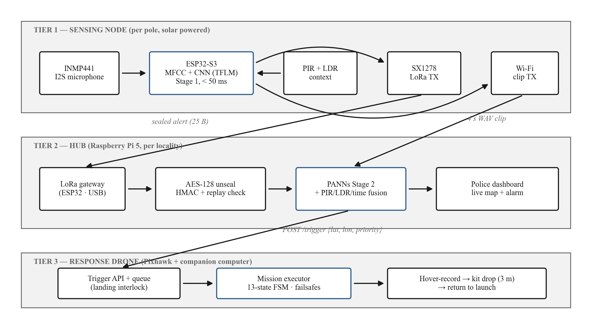
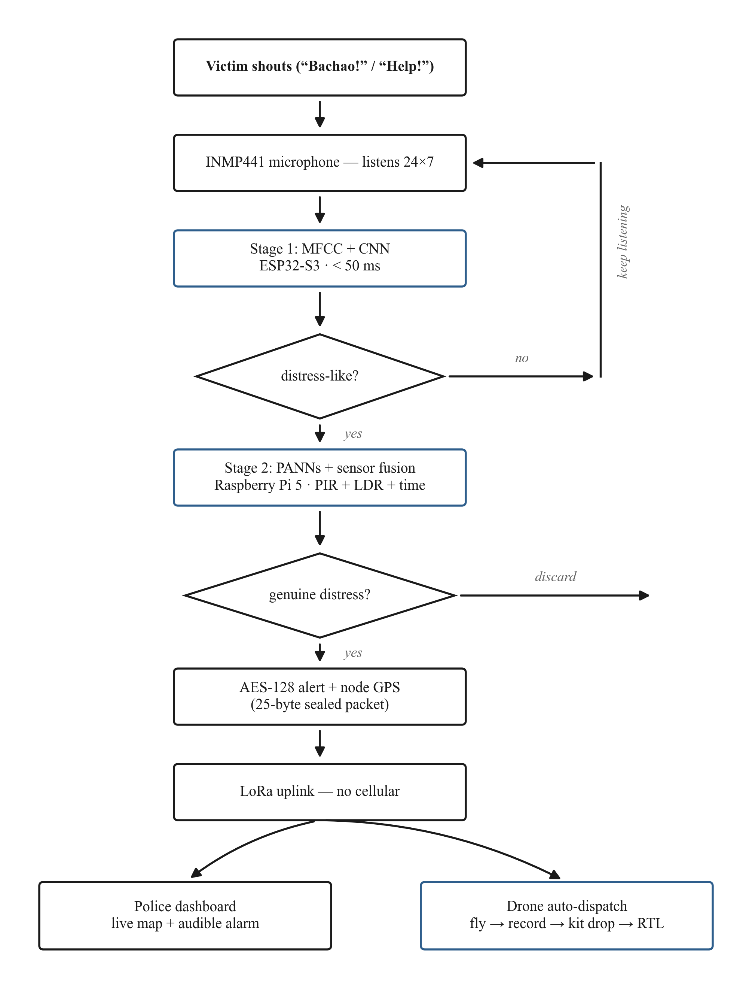
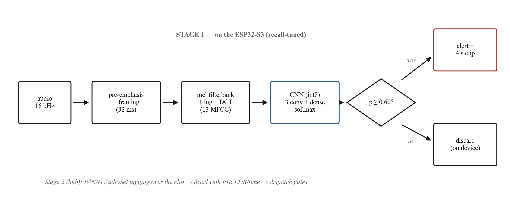
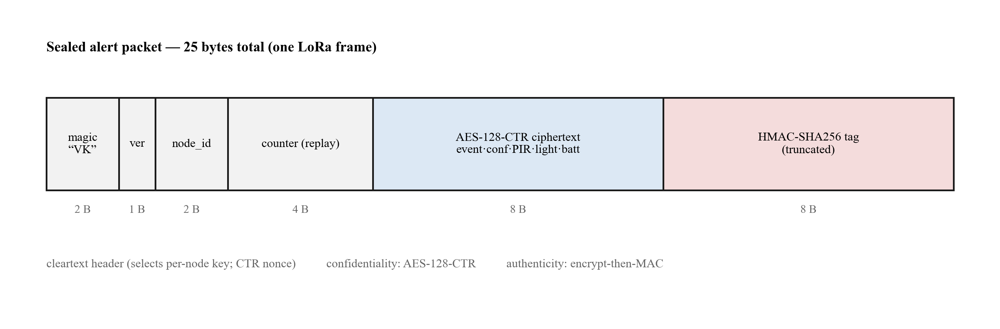
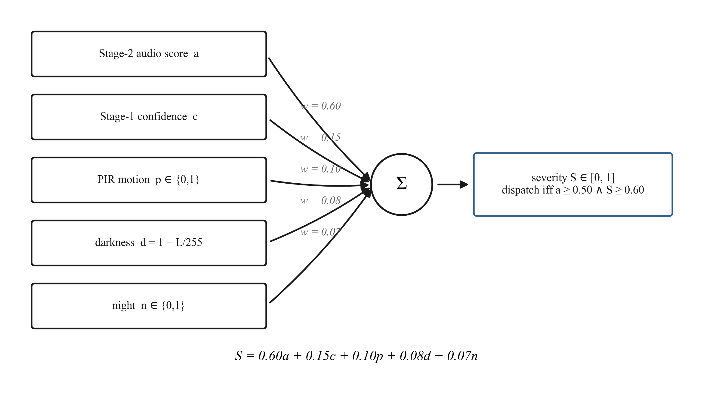
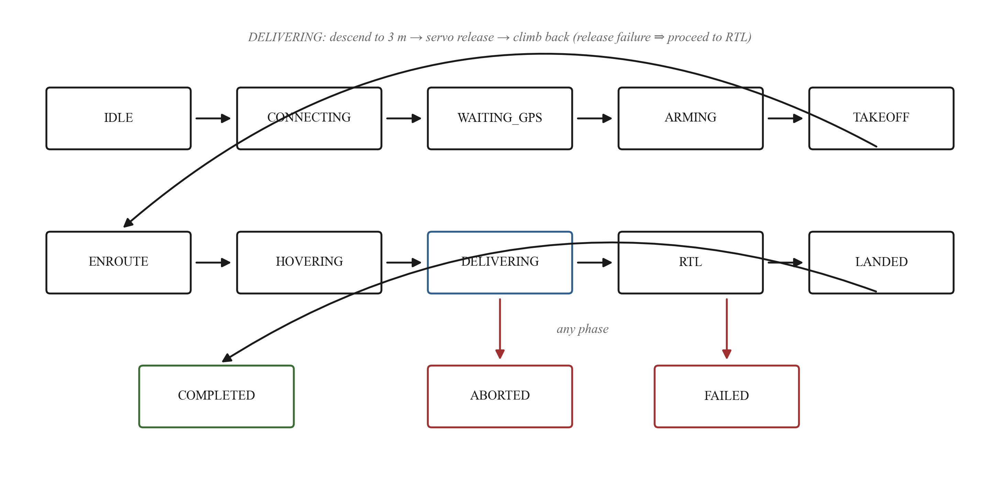
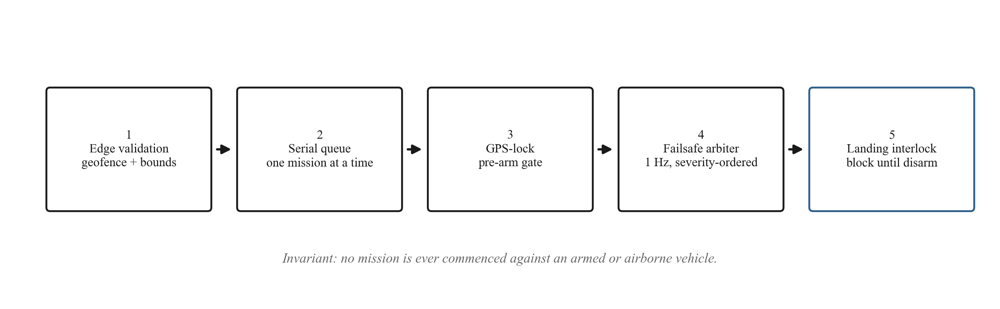
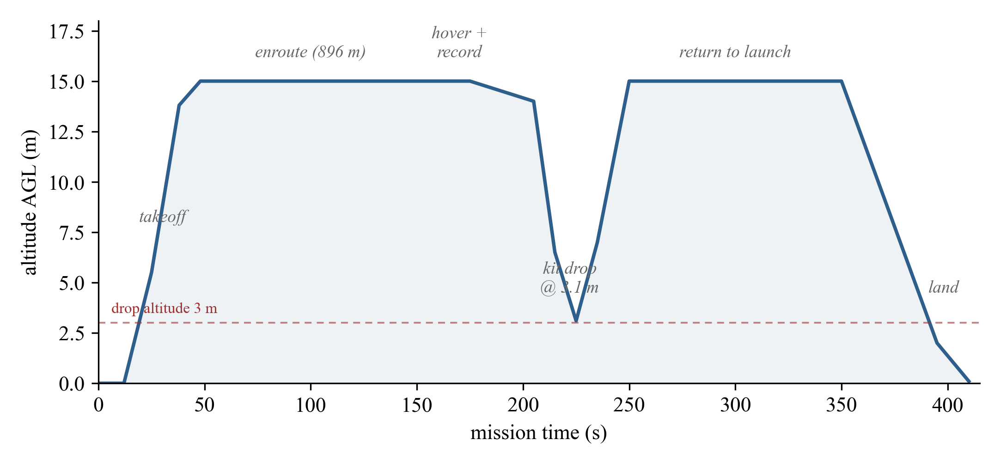

# VanniKawachh: A Distributed AI Acoustic Intelligence and Autonomous Drone Response Network for Women Safety

**A Thesis**

**Submitted in partial fulfilment of the requirements of the**
**Bachelor of Technology in Computer Science and Engineering**

**by Group CSE_B_04**

Shivansh Verma · Saksham Sabadra · Rudra Thakur · Rohan Untawale

**under the guidance of**
**Dr. Aditya Turankar**

Department of Computer Science and Engineering
G. H. Raisoni College of Engineering, Nagpur
**Session 2026-27**

---

## Declaration

We declare that this thesis is our own work, carried out by us as Group
CSE_B_04 under the guidance of Dr. Aditya Turankar, and that all sources
of material used (software libraries, protocol specifications, model
checkpoints, regulatory texts, and surveyed literature) are cited in the
References. The software described herein is published under the
repository <https://github.com/SV-1411/drone.git>, and all experimental
results reported are reproducible from that repository as described in
Chapter 6. A large-language-model assistant was used during drafting for
structure and consistency; all technical content derives from the
implementation and its test logs, and every sentence was reviewed and
accepted by the authors.

*(Signatures and date to be completed.)*

---

## Abstract

Crimes against women often happen where help is hardest to reach: dark
streets, forest stretches, campus outskirts, and parking areas. These
places have few cameras, few patrols, and often no cellular coverage.
Most safety technology aimed at this problem burdens the victim:
panic-button apps, wearables, and carried devices all assume a charged,
reachable device in the victim's hand at the moment of attack. This
thesis designs, implements, and validates **VanniKawachh**
("voice-shield"), a system that inverts the burden: the *infrastructure*
listens, verifies, alerts, and responds, and the victim's own voice is
the only trigger she needs.

The system is a three-tier network. **Sensing nodes**, solar-powered
pole-mounted ESP32-S3 boards with INMP441 I2S microphones, screen every
audio frame on-device with a lightweight MFCC + CNN model (Stage 1,
< 50 ms per frame, recall-tuned), so no continuous audio ever leaves a
pole. A **Raspberry Pi 5 hub** confirms each candidate event with PANNs
deep audio tagging fused with PIR motion, ambient-light, and time-of-day
evidence (Stage 2, precision-tuned). Confirmed alerts are AES-128-CTR
encrypted, HMAC-authenticated, and replay-protected, and they carry the
node's surveyed coordinates from a registry rather than a live GPS fix.
They travel over LoRa, with no SIM or cellular dependency, to a police
dashboard, and simultaneously auto-dispatch a Pixhawk quadcopter that
flies to the spot, records evidence during hover, descends to 3 m,
drops a first-aid kit, and returns to launch. The response layer is the
group's previously built and SITL-verified autonomous flight stack
(verified mode transition, a landing-interlocked mission queue, and a
debounced severity-ordered failsafe arbiter), carried over unchanged.

Validation is staged, and we state clearly what has not been measured.
The complete chain (synthesized distress audio → sealed packet → hub
verification and fusion → dispatch → autonomous SITL flight with
hover-record and kit release) runs end-to-end with zero hardware
(Phase 0). The full-chain rehearsal passed with a fused severity of 0.88
and kit release commanded at 3.1 m, inside a 328 s mission, and the
flight stack's acceptance harness passes all 8/8 checks with 0.4 to
0.6 m terminal accuracy against a 5 m tolerance. Sixty-eight automated
unit cases pin the safety logic, the packet cryptography, and the
dispatch gating. Stage-1 model training on the microcontroller and
hardware range/latency measurements are Phase 1 and 2 work in progress;
the development chain uses clearly labelled heuristic stand-ins, and
this thesis reports no acoustic accuracy number it has not measured.

**Keywords:** women safety; acoustic event detection; edge AI; TinyML;
PANNs; sensor fusion; LoRa; AES-128; autonomous UAV; verified dispatch;
software-in-the-loop validation.

---

## Table of Contents

1. Introduction
2. Literature Review
3. System Design
4. Implementation of the Sensing Node and Hub
5. Implementation of the Response Layer (Safety-Verified Autonomous Flight)
6. Testing and Results
7. Safety, Privacy, and Legal Compliance
8. Conclusions and Future Work
References
Appendix A: LoRa Alert Packet Wire Format
Appendix B: Configuration Reference
Appendix C: Test Inventory

---

# Chapter 1: Introduction

## 1.1 Motivation

Consider where an assault actually happens. It is rarely on a well-lit
arterial road under a CCTV camera. It is on the dark stretch between
two streetlights, on the shortcut through a wooded campus edge, or in
the far corner of a parking area at 23:40. These locations share three
properties. First, they are *surveillance dead zones*: no camera, no
patrol, often marginal or absent cellular coverage. Second, they are
*response dead zones*: even a successful emergency call produces a
ground unit minutes away through traffic. Third, and this is the
property existing technology ignores, they are places where the victim
is least able to operate a device: hands occupied, phone snatched,
discharged, or simply out of reach in the seconds that matter.

The market's answer has been to instrument the victim. Panic-button
mobile apps, smart wearables, GPS pendants, and IoT panic devices all
place the trigger on the person at risk. The best of these report high
accuracies, but the failure mode is structural: *a safety device the
victim must carry, charge, and reach protects only the moments in which
she can carry, charge, and reach it.* The research community's
alternative, audio surveillance systems that detect screams, has
demonstrated strong detection rates, but on server-scale compute, and
it stops at detection. The output is a classifier score, not a located
alert or a response on the ground.

What is missing is *infrastructure that owns the whole chain*: sensing
that asks nothing of the victim, verification that suppresses false
alarms well enough to act on, alert delivery that works precisely where
cellular does not, and a first response that arrives in seconds rather
than minutes. VanniKawachh is a design, an implementation, and a staged
validation of that chain.

## 1.2 The inverted-burden principle

VanniKawachh's single organizing idea is that the burden of triggering
help must move from the victim to the environment. A scream, a cry, or
a shouted "help" / "bachao" is a signal the victim produces anyway,
under any circumstance, with no device. If pole-mounted infrastructure
can hear it, verify it, and act on it, then the victim's participation
requirement drops to zero: no app, no wearable, no phone, no button.

The engineering consequences of that idea drive every design decision
in this thesis:

- **Nodes must be cheap, solar, and everywhere.** So the node is an
  ESP32-S3 class microcontroller with a TinyML Stage-1 model rather
  than a streaming link to a server.
- **False alarms must be suppressed before anything expensive
  happens.** A drone launch is costly and attention-consuming, so a
  second, heavier verification stage runs at a hub, fused with
  environmental evidence.
- **The alert path must not depend on cellular coverage.** The target
  locations are dead zones by definition, so the alert travels over
  LoRa.
- **An alert that launches a drone must be unforgeable.** So every
  packet is encrypted, authenticated, and replay-protected.
- **The response aircraft must be trusted to fly unattended.** So the
  response layer is a flight stack whose safety properties are pinned
  by automated tests, built and validated before this concept existed
  (v1 of this project) and carried over unchanged.

## 1.3 Problem statement

*Design and implement a distributed safety network in which
pole-mounted acoustic nodes detect distress audio on-device, a locality
hub confirms each event with deep audio analysis fused with
environmental evidence, confirmed alerts travel encrypted over LoRa
with the node's surveyed coordinates to a police-facing dashboard, and
an autonomous quadcopter is dispatched to the incident to record
evidence and deliver a first-aid kit, such that (i) no continuous
audio leaves any node; (ii) no alert can be spoofed or replayed into a
drone launch; (iii) no dispatch occurs below explicit verification and
severity thresholds; (iv) every flight-mode command is confirmed from
autopilot telemetry, no mission can start against an airborne vehicle,
and hazard responses obey debounce, severity, and escalation semantics;
and (v) each of these properties is demonstrated by automated,
reproducible tests before it is claimed.*

## 1.4 Scope

In scope: the three-tier architecture; the node firmware structure and
its Stage-1 pipeline; the complete hub service (packet cryptography,
registry, Stage-2 verification, evidence fusion, dispatch gating); the
response flight stack and its payload/camera extensions; end-to-end
validation in software-in-the-loop simulation (Phase 0); and the
specification of the hardware build phases. Out of scope for the
prototype, and stated as such wherever relevant: the trained Stage-1
TFLite-Micro model (Phase 1 work in progress; the dev chain uses a
heuristic stand-in), hardware range and latency measurements (Phase
1 and 2), live video streaming to police, multi-node time-difference
localization, and beyond-visual-line-of-sight flight operations.

## 1.5 Contributions

1. An **end-to-end architecture** (infrastructure sensing → two-stage
   verification → offline encrypted alerting → autonomous field
   response) where prior work covers at most one link of the chain
   (Chapter 2, Chapter 3).
2. A **two-stage edge/hub acoustic pipeline**: a recall-tuned
   MFCC + CNN screen on the node (< 50 ms budget) and a
   precision-tuned PANNs + sensor-fusion confirmation on the hub, with
   explicit thresholds gating dispatch (Chapter 4).
3. A **secure LoRa alert protocol**: a 25-byte sealed packet
   (AES-128-CTR + truncated HMAC-SHA256 + per-node monotonic replay
   counter, per-node keys derived from a master key) carrying an event
   class rather than coordinates, resolved against a surveyed node
   registry at the hub (Chapter 4, Appendix A).
4. A **safety-verified autonomous response layer** inherited from the
   group's v1 flight stack (verified mode transition, landing
   interlock, failsafe arbitration), extended with an evidence camera
   phase and a rule-bounded first-aid kit drop (descend to 3 m,
   release, fail → RTL) (Chapter 5).
5. A **staged validation methodology**: 68 automated unit
   cases, an 8/8 SITL acceptance flight, and a zero-hardware
   full-chain rehearsal (Phase 0) that proves the architecture before
   any soldering, with heuristic stand-ins labelled as such
   (Chapter 6).

## 1.6 Thesis organization

Chapter 2 surveys the literature and locates the gap. Chapter 3
presents the three-tier design and its rationale. Chapter 4 details
the sensing node and hub implementation. Chapter 5 details the
response layer: the safety engineering of the flight stack, retained
from v1 because it is unchanged and still load-bearing. Chapter 6
defines the validation methodology and reports results, including what
has *not* yet been measured. Chapter 7 consolidates the safety,
privacy, and legal posture. Chapter 8 concludes.

---

# Chapter 2: Literature Review

## 2.1 Survey method

The group's literature survey (twelve papers, 2023 to 2026, first
catalogued in the Title Finalization Seminar record and reproduced
with full bibliographic detail as references [1] to [12] of this
thesis) covered the women-safety technology space across two
communities: consumer/IoT safety devices and acoustic event detection.
Every surveyed system falls into one of two buckets, and the buckets
split on a single question: who carries the trigger?

## 2.2 Bucket 1: victim-carried devices

Mobile panic applications, smart wearables (bands, pendants, footwear
sensors), and standalone IoT panic buttons ([1], [5], [6], [9], [10],
[11]) place the sensing and triggering hardware on the victim.
Pavithra et al. [1] present a discreet smartphone application with
on-device audio recognition and emergency automation; Bharathi et
al. [5] describe an IoT wearable combining GPS and accelerometer
sensing and report **97.54%** detection accuracy with a 3.2 s
response time and a 1.92% false-positive rate; Snehith et al. [6]
and Hadkar et al. [9] present push-button/wearable IoT devices with
locate-and-alert behaviour; Uganya et al. [10] describe a
button-triggered GSM/GPS tracker; and Potturi et al. [11] automate
the SOS trigger with GSM/GPS geo-location sharing. The stronger
systems combine multiple modalities (accelerometer gestures,
heart-rate anomalies, voice keywords), and GPS positioning with
GSM/app-based alerting is near-universal in this bucket.

The limitation is availability rather than accuracy. Every system in
this bucket fails the same way when the device is absent, damaged,
discharged, snatched, or simply unreachable in the moment. These are
exactly the conditions of a real assault. A 97.5%-accurate classifier
on a device that is not in the victim's hand protects nobody. The
bucket also inherits cellular dependence: app and GSM alerting presume
coverage that the highest-risk locations often lack. Uganya et al.'s
tracker [10], for example, does not work in the GSM dead zones where
risk is highest.

## 2.3 Bucket 2: detection-only audio systems

The acoustic event detection literature ([2], [3], [4], [7], [8])
demonstrates that distress audio is machine-detectable at useful
rates. Kim et al. [7] built an 11,921-sample large-scale scream
dataset and found a CNN-Transformer to be the best of five evaluated
models; the same group [2] later added a windowing CNN for scream
temporal-interval prediction, improving F-measure by roughly three
percentage points and equal-error rate by an order of magnitude.
Sharma and Jebaseeli [3] report a scream-and-panic detector at **92%**
accuracy with under 5% false positives; Fime et al. [8] achieve
**95.51%** danger-sound accuracy with Noisereduce preprocessing and
transfer-learned image backbones (InceptionV3, with MobileNetV2 as a
lighter alternative) over mel-spectrogram inputs; and Srimathi et
al. [4] show that scream detection can reduce reaction time by 40%
and increase intervention rates by 30%. Ciaburro and Puyana-Romero's
systematic review of sound-event detection in smart cities [12]
confirms both the maturity of detection methods and the near-absence
of closed-loop response systems in the literature.

Three limitations recur across this bucket. First, **compute scale**:
the reported models are server- or workstation-class ([2], [7]); none
runs on a solar pole budget. Second, **deployment binding**:
evaluations are on curated datasets or tethered laboratory
microphones, not distributed outdoor infrastructure. Third, and
decisive for this thesis, **the chain stops at detection**: a positive
classification is the *output* of these systems, with no location
delivery, no alerting path engineered for dead zones, and no response
on the ground [12].

## 2.4 The gap

Overlaying the buckets exposes the gap this project fills. Bucket 1
has response paths (alerts to guardians/police) but burdens the
victim. Bucket 2 removes the victim's burden but has no response path.
**No surveyed system provides end-to-end infrastructure sensing →
verified offline alerting → autonomous field response.** That chain,
with each link individually feasible on published evidence, is
VanniKawachh's contribution, and each link imports a discipline from a
different literature: TinyML keyword spotting for the node [14],
large-scale pretrained audio tagging (PANNs [13]) for the hub, LPWAN
practice for the alert path [16], [32], and the group's own
SITL-verified dispatch stack for the response [15], [22] to [24].

## 2.5 Technology base

**TinyML on microcontrollers.** TensorFlow Lite Micro [14] runs
quantized CNNs in tens of kilobytes of RAM; the `micro_speech` class
of MFCC-fronted keyword models is a proven template for sub-50 ms
audio screening on ESP32-class silicon.

**PANNs.** Pretrained Audio Neural Networks [13] (CNN14 and lighter
variants trained on AudioSet) provide calibrated per-class
probabilities over hundreds of sound events, including the
distress-relevant family (screaming, shouting, crying, yelling,
wailing). Summing probability mass over that family yields a distress
score without training a bespoke model, which suits a Stage-2
verifier on a Raspberry Pi 5.

**LoRa.** Semtech SX1278-class radios [32] deliver kilometre-scale
links at roughly 1 to 5.5 kbps effective throughput with no network
operator (the LoRaWAN specification [16] documents the underlying
modulation and regional parameters). That is enough for a 25-byte
alert and far too little for audio, which shapes the split transport
design of §3.3.

**The autopilot stack.** ArduPilot and MAVLink [15] and
software-in-the-loop simulation [24] are covered in the group's v1
work; Chapter 5 summarizes what carries over. The v1 finding that
motivates the whole project's verification philosophy bears repeating:
the standard client idiom for changing flight mode was observed to
fail *silently* on ArduCopter 3.3 SITL: the library reports success
while the autopilot ignores the command. The design answer, *a
detection claimed is not a detection confirmed; a command sent is not
a command adopted*, now governs every layer of VanniKawachh: sound,
dispatch, and flight mode alike.

**Regulation.** India's Drone Rules, 2021 (G.S.R. 589(E)) [19] govern
the prototype's flight operations (registration, zone constraints,
visual line of sight); the Digital Personal Data Protection Act, 2023
[20] and plain privacy prudence govern the audio design; and the
Wireless Planning and Coordination Wing's delicensing framework [21]
governs the radio links. Chapter 7 consolidates all three.

---

# Chapter 3: System Design

## 3.1 Three tiers

Figure 3.1 shows the three-tier component architecture; the text
schematic below annotates the same chain with the concrete hardware
and software of each tier.



*Figure 3.1: VanniKawachh three-tier system architecture: per-pole
solar sensing nodes, the per-locality Raspberry Pi 5 hub, and the
autonomous response drone.*

```
┌────────────── SENSING NODE (per pole, solar) ──────────────┐
│ INMP441 I2S mic → ESP32-S3: MFCC + tiny CNN (TFLM, <50 ms) │
│ PIR (HC-SR501) + LDR context · Stage-1 hit → alert + clip  │
└──────────────┬─────────────────────────────┬───────────────┘
        LoRa SX1278 (alert, AES-128)   ESP-NOW / WiFi (4 s audio clip)
               ▼                             ▼
┌────────────── HUB (Raspberry Pi 5, per locality) ──────────┐
│ LoRa gateway (ESP32 + SX1278 on USB serial)                │
│ Stage 2: PANNs (CNN14/CNN10) + PIR/LDR/time fusion score   │
│ Node registry: node_id → surveyed (lat, lon)               │
│ Police dashboard (live map + alarm) · alert log            │
└──────────────┬─────────────────────────────────────────────┘
         POST /trigger {lat, lon, incident_type, priority}
               ▼
┌────────────── RESPONSE DRONE (v1 stack, unchanged core) ───┐
│ trigger_api (FastAPI queue) → mission_executor (13-state   │
│ FSM, verified mode setter, failsafe arbiter, landing       │
│ interlock, obstacle keep-out routing)                      │
│ v2: HOVERING + camera record → DELIVERING (SG90 kit drop   │
│     from 3 m; fail → RTL) → RTL                            │
└────────────────────────────────────────────────────────────┘
```

*The VanniKawachh chain in schematic form (cf. Figure 3.1). Each tier
verifies before it acts: the node screens, the hub confirms, the
flight stack confirms its own commands.*

**Tier 1: sensing node.** One per pole. An ESP32-S3 continuously
frames 16 kHz mono audio from an INMP441 I2S microphone, extracts MFCC
features, and runs a tiny quantized CNN (TensorFlow Lite Micro,
`micro_speech`-class) against the distress vocabulary: scream, cry,
and the "help" / "bachao" keyword family. Budget: under 50 ms per
frame. An HC-SR501 PIR sensor and an LDR provide motion and
ambient-light context sampled alongside. A Stage-1 hit produces
exactly two transmissions: a sealed 25-byte alert over LoRa, and a
4 s audio clip over ESP-NOW/WiFi. Otherwise the node transmits
nothing.

**Tier 2: hub.** One Raspberry Pi 5 per locality. A gateway ESP32
with an SX1278 bridges LoRa to USB serial. The hub authenticates and
decrypts each packet, resolves the node's surveyed coordinates from a
registry, waits briefly for the WiFi clip, re-scores the audio with
PANNs, fuses the score with PIR/LDR/time evidence into a severity,
and, only above two explicit thresholds, dispatches the drone and
raises the police dashboard alarm. Every incident, dispatched or not, is
logged.

**Tier 3: response drone.** The group's v1 flight stack: a FastAPI
trigger surface, a priority mission queue, and a mission-executor
state machine supervised by a failsafe arbiter. v2 adds a camera
recording window during hover and a DELIVERING phase that descends to
3 m and releases a first-aid kit by servo. The stack's safety core is
untouched.

## 3.2 Design decisions and rationale

**Fixed nodes carry no live GPS.** Each pole is surveyed once at
installation (NEO-6M or a phone fix); the hub's registry maps
`node_id → (lat, lon, name)`. The LoRa packet therefore carries two
bytes of identity instead of a coordinate pair. This is smaller, and
it cannot be spoofed at the position level: a node has no GPS to jam,
drift, or forge. An unknown `node_id` is dropped at the hub.

**LoRa carries the alert; WiFi carries the audio.** LoRa's roughly
1 to 5.5 kbps cannot move a clip in useful time, so the transports
split: the sealed alert goes over LoRa instantly (dead-zone-capable,
kilometre-scale), and the 4 s verification clip follows over
ESP-NOW/WiFi (~250 kbps, hundreds of metres line-of-sight).

The split is a direct consequence of LoRa's physical layer. The
duration of one LoRa symbol at spreading factor SF over bandwidth BW
is

$$T_s = \frac{2^{\mathrm{SF}}}{\mathrm{BW}} \tag{3.1}$$

so higher spreading factors buy sensitivity at the price of airtime.
The receiver's minimum detectable signal is

$$P_{\min}\ [\mathrm{dBm}] = -174 + 10\log_{10}(\mathrm{BW}) +
\mathrm{NF} + \mathrm{SNR}_{\min} \tag{3.2}$$

where NF is the receiver noise figure and SNR\(_{\min}\) the
demodulation threshold for the chosen SF.
Evaluating the standard LoRa time-on-air formula for the system's
25-byte packet at SF9, 125 kHz bandwidth, coding rate 4:5 gives
approximately **0.21 s** of airtime per alert; moving a 4 s, 16 kHz,
16-bit clip (128 kB) over the same link would take on the order of
*minutes*. Hence alert-on-LoRa, clip-on-WiFi: the safety-critical
25 bytes ride the long-range dead-zone-capable channel, and the bulk
audio rides the short-range fast one.

The design degrades gracefully: if
the clip never arrives within the configured wait (8 s), the hub falls
back to the Stage-1 confidence at a haircut (× 0.6): enough to log
always, and to dispatch only if the evidence is otherwise strong.
Multi-node corroboration slots into the same fallback point as future
work.

**Stage 1 is recall-tuned; Stage 2 is precision-tuned.** The node's
job is to *never miss* a real event; its false positives are expected
and cheap, because the hub filters them with a model three orders of
magnitude larger, plus environmental evidence. This division mirrors
the economics: waking the hub costs milliwatts; launching the drone
costs a mission. The philosophy is the v1 flight stack's *verified
dispatch* applied to sound.

**Every LoRa packet is sealed.** A spoofed packet would launch a
drone. §4.3 details the AES-128-CTR + HMAC + replay-counter
construction.

**The flight core is untouched.** All v1 safety machinery (verified
mode setter, failsafe arbiter, landing interlock, geofence, stall
detection, obstacle keep-out routing) carries over unchanged. It is
the reason the response half of this project already works, and
Chapter 5 documents it as the response layer.

## 3.3 The mission lifecycle (response tier)

The executor's state machine threads IDLE → CONNECTING → WAITING_GPS →
ARMING → TAKEOFF → ENROUTE → HOVERING → **DELIVERING** → RTL → LANDED
→ COMPLETED, with ABORTED and FAILED as abnormal terminals: thirteen
states in v2 (DELIVERING is the addition). Three v1 properties are
preserved: no state waits for human input; every transition is
timestamped into the mission log; every blocking loop polls both the
failsafe arbiter and the operator-cancel flag, so abnormal termination
is reachable from anywhere. The hover window doubles as the
evidence-recording window; DELIVERING runs only when the mission
requests a kit drop.

## 3.4 Data flow, end to end

Figure 3.2 traces one incident through the system, from the shout to
the drone's return; the numbered steps below give the corresponding
software interfaces.



*Figure 3.2: Methodology flow: from the victim's shout through
Stage-1 screening, Stage-2 verification and fusion, the sealed LoRa
alert, to the police dashboard and the drone auto-dispatch.*

1. Node: Stage-1 hit → sealed alert (LoRa) + 4 s clip (WiFi).
2. Gateway ESP32: LoRa RX → one line per packet over USB serial. The
   gateway does no crypto and no parsing beyond framing; all
   intelligence stays on the Pi, where it can be updated without
   reflashing.
3. Hub pipeline: unseal (MAC, replay) → registry lookup → wait for
   clip → Stage-2 score → fusion → threshold gate → dispatch + log.
4. Drone stack: `POST /trigger {lat, lon, incident_type, priority}` →
   queue → mission with hover-record and kit drop → RTL.
5. Dashboard: incident appears on the police-facing map with severity,
   reasons, and mission id; the mission is trackable live.

---

# Chapter 4: Implementation of the Sensing Node and Hub

## 4.1 Node firmware (`firmware/node/`)

The sensing node is a single Arduino sketch for the ESP32-S3
structured as the pipeline of §3.1: I2S capture from the INMP441 at
16 kHz mono; framing and MFCC feature extraction; the TFLite-Micro
Stage-1 model hook; PIR and LDR sampling; AES-sealed LoRa alert
transmission (SX1278, LoRa library by Sandeep Mistry); and the
ESP-NOW/WiFi clip upload to the hub's clip server. The alert carries
the event class (1 = scream, 2 = help_keyword, 3 = cry, 4 = crash),
the Stage-1 confidence quantized to a byte, the PIR flag, the raw LDR
level, the node battery percentage, and the monotonic packet counter.
Figure 4.1 shows the Stage-1 pipeline as implemented on the node.



*Figure 4.1: The two-stage acoustic pipeline. Stage 1 on the
ESP32-S3 (recall-tuned): 16 kHz audio → pre-emphasis and 32 ms
framing → mel filterbank + log + DCT (13 MFCCs) → int8 CNN → alert +
clip on a hit, on-device discard otherwise. Stage 2 on the hub runs
PANNs tagging over the clip and fuses it with PIR/LDR/time before the
dispatch gates.*

**The Stage-1 mathematics.** The feature front-end is the classical
MFCC chain. Each incoming frame is first pre-emphasized to flatten
the spectral tilt of speech,

$$y[n] = x[n] - 0.97\,x[n-1] \tag{4.1}$$

then windowed with a Hamming window of length $N$,

$$w[n] = 0.54 - 0.46\cos\!\left(\frac{2\pi n}{N-1}\right) \tag{4.2}$$

before the FFT. The power spectrum is pooled by a bank of $M$
triangular filters spaced uniformly on the mel scale,

$$m = 2595\,\log_{10}\!\left(1 + \frac{f}{700}\right) \tag{4.3}$$

and the log energy of each filter output is taken,

$$e_j = \log\!\left(\sum_{k} H_j(k)\,\lvert X(k)\rvert^2\right),
\qquad j = 1,\dots,M \tag{4.4}$$

where $H_j$ is the $j$-th triangular filter. A DCT-II decorrelates
the log energies into the cepstral coefficients

$$c_i = \sum_{j=1}^{M} e_j
\cos\!\left[\,i\left(j - \tfrac{1}{2}\right)\frac{\pi}{M}\right],
\qquad i = 0,\dots,12 \tag{4.5}$$

of which the first **13** are retained as the frame's feature vector.

The classifier head is a small CNN ending in a softmax over the $K$
event classes,

$$p_k = \frac{e^{z_k}}{\sum_{j=1}^{K} e^{z_j}} \tag{4.6}$$

trained (Phase 1) by minimizing the cross-entropy loss

$$\mathcal{L} = -\sum_{k=1}^{K} y_k \log p_k \tag{4.7}$$

against one-hot labels $y$. For deployment under TensorFlow Lite
Micro the weights and activations are quantized to int8 with the
affine map

$$x_q = \mathrm{round}\!\left(\frac{x}{s}\right) + z \tag{4.8}$$

where $s$ is the per-tensor scale and $z$ the zero point. This step
shrinks the model into the ESP32-S3's RAM budget and the < 50 ms
frame deadline.

**Status honesty.** The firmware's capture, sensing, sealing, and
transport paths are implemented; the Stage-1 *model* is a hook. 
Training the quantized MFCC + CNN on scream/cry/keyword data and
flashing it is Phase 1 work in progress (§6.5). Nothing in this thesis
claims an on-device detection accuracy.

## 4.2 Hub service (`hub/`)

The hub is a Python package on the Raspberry Pi 5, one module per
responsibility:

| Module | Responsibility |
|---|---|
| `hub/config.py` | Env-driven settings: serial port, master key, thresholds, drone API URL |
| `hub/node_registry.py` | `node_id → (lat, lon, meta)`, JSON-backed; unknown id ⇒ packet dropped; tracks each node's last counter |
| `hub/packets.py` | 25-byte packet format; AES-128-CTR seal/unseal, truncated HMAC-SHA256, replay counter (§4.3) |
| `hub/lora_gateway.py` | Reads the gateway ESP32's USB serial stream; `--sim` mode substitutes synthetic packets |
| `hub/webapp.py` | Receives the nodes' 4 s WAV clips over WiFi and serves the police dashboard (live map + alarm) |
| `hub/verifier.py` | Stage-2 scoring: PANNs backend, or an energy-heuristic dev fallback (§4.4) |
| `hub/fusion.py` | Severity fusion of audio score with PIR/LDR/time evidence (§4.5) |
| `hub/pipeline.py` | The gate: alert → verify → fuse → dispatch decision; no dispatch below threshold |
| `hub/dispatcher.py` | POSTs `/trigger` to the drone stack with the node's surveyed coordinates |
| `hub/main.py` | Entrypoint: `python -m hub.main` (serial) or `--sim` |

The pipeline (`process_packet`) executes the full chain for one sealed
packet: authenticate + decrypt + replay-check; registry lookup (bump
the node's counter only after acceptance); wait up to 8 s for the
clip at `hub/clips/<node_id>_<counter>.wav`; Stage-2 score the clip,
or, if the clip never arrives, substitute the degraded audio score

$$a = 0.6\,c \tag{4.9}$$

where $c$ is the Stage-1 confidence (the no-clip haircut of §3.2);
fuse; then gate: dispatch requires **both** `audio_score ≥ 0.50`
(`VERIFY_THRESHOLD`) **and** `severity ≥ 0.60` (`DISPATCH_THRESHOLD`).
Below either threshold the incident is logged with its reasons and no
drone flies. Every incident, dispatched or not, is appended to the
incident list that feeds the dashboard.

## 4.3 Packet security (`hub/packets.py`)

The threat model is simple: a spoofed packet launches a drone; an
eavesdropped packet reveals an incident in progress; a replayed packet
re-launches a drone at an attacker's chosen time. The wire format
(25 bytes, which fits in one LoRa frame; Figure 4.2, full layout in
Appendix A) answers all three:



*Figure 4.2: The sealed 25-byte alert packet: cleartext header
(magic, version, node_id, counter), AES-128-CTR ciphertext of the
8-byte payload, and the truncated HMAC-SHA256 tag.*

- **Confidentiality:** the 8-byte payload (event, confidence, PIR,
  light, battery) is AES-128-CTR encrypted. The CTR nonce is derived
  from the cleartext header (magic, version, node_id, counter), unique
  per packet as long as the counter is monotonic.
- **Authenticity:** an 8-byte MAC (HMAC-SHA256 over header +
  ciphertext, truncated) using the per-node key. A bad MAC is dropped
  before decryption is trusted.
- **Replay protection:** the uint32 counter is monotonic per node; the
  hub rejects any counter ≤ the last accepted value for that node.
- **Key management:** each node key is derived as
  `HMAC-SHA256(master_key, "node:<id>")[:16]`, so provisioning a node
  requires only the master key and its id; the hub holds one secret.

`node_id` and `counter` travel in cleartext by necessity (the id
selects the key; the counter builds the nonce). Neither is sensitive,
and both are covered by the MAC.

Formally, the construction is as follows. Node $n$'s key is derived
from the hub's master key $K_m$ as

$$K_n = \mathrm{HMAC\text{-}SHA256}\!\left(K_m,\ \texttt{"node:}n\texttt{"}\right)[0{:}16] \tag{4.10}$$

so the hub holds one secret and each node holds only its own derived
key. The 8-byte payload $P$ is encrypted in counter mode,

$$C = P \oplus E_{K_n}(\mathrm{IV}) \tag{4.11}$$

where $E$ is AES-128 [17] and the initial counter block IV is built
from the cleartext header (magic, version, node_id, counter). The IV
is unique per packet as long as the node's counter is monotonic. The
authentication tag is an encrypt-then-MAC over everything on the
wire,

$$\mathrm{tag} = \mathrm{HMAC\text{-}SHA256}\!\left(K_n,\ \mathrm{header} \parallel C\right)[0{:}8] \tag{4.12}$$

and the hub accepts a packet if and only if

$$\mathrm{tag\ valid}\ \wedge\ \mathrm{counter} > \mathrm{counter}_{\mathrm{last}} \tag{4.13}$$

for that node, bumping $\mathrm{counter}_{\mathrm{last}}$ only after
acceptance. The truncated 8-byte tag leaves a blind-forgery success
probability of $2^{-64}$ per attempt, which is negligible at LoRa
alert rates; the trade-off would be revisited if the channel were
ever widened.

## 4.4 Stage-2 verification (`hub/verifier.py`)

Two interchangeable backends behind one interface (`verify_wav(path) →
score in [0, 1]`):

- **PANNs (production).** The pretrained AudioSet tagging model
  (`panns-inference`, CNN14 by default; CNN10 or a MobileNet variant
  if the Pi is slow). The distress score is the summed probability
  over the distress-relevant AudioSet classes (screaming, shouting,
  yelling, crying, wailing, groaning, whimpering), clamped to 1.0.
  No bespoke training is required: the verifier leans on AudioSet
  scale, which a per-locality hub can afford to run and a pole
  cannot.
- **Energy heuristic (dev/SITL fallback).** Loud + high-spectral-
  centroid + bursty audio scores high (weights 0.45/0.35/0.20). This
  backend exists so the entire chain runs on any machine with no
  torch installation. It is **not** a claim of detection accuracy,
  and every result produced with it is labelled as fallback,
  including the Phase-0 numbers of Chapter 6.

The fallback scorer is worth stating exactly, because it gates the
Phase-0 rehearsal. Over the clip's samples $x[n]$, $n = 1,\dots,N$, it
computes the loudness as the root-mean-square level

$$\mathrm{RMS} = \sqrt{\frac{1}{N}\sum_{n=1}^{N} x[n]^2} \tag{4.14}$$

and the spectral centroid (the "brightness" of the clip, high for
screams)

$$C = \frac{\sum_{k} f_k\,\lvert X(k)\rvert}{\sum_{k}\lvert X(k)\rvert} \tag{4.15}$$

where $X(k)$ is the magnitude spectrum at frequency $f_k$. Together
with a burstiness term ($\mathrm{burst} \in [0,1]$, from the envelope's
peak-to-mean structure) the score is

$$\mathrm{score} = 0.45\,\min\!\left(1, \frac{\mathrm{RMS}}{0.15}\right)
+ 0.35\,\mathrm{clip}\!\left(\frac{C - 400}{1600},\,0,\,1\right)
+ 0.20\,\mathrm{burst} \tag{4.16}$$

i.e. full loudness credit at RMS ≥ 0.15 full scale, and centroid
credit ramping linearly from 400 Hz to 2 kHz.

## 4.5 Evidence fusion (`hub/fusion.py`)

A night-time scream in a dark spot with motion nearby carries more
weight than a daytime shout on a busy road. With $a$ the Stage-2
audio score, $c$ the Stage-1 confidence, $p \in \{0,1\}$ the PIR
motion flag, $L \in [0,255]$ the LDR light level, and $n \in \{0,1\}$
the night indicator (1 between 20:00 and 06:00), the fused severity
is the weighted sum (Figure 4.3)

$$S = 0.60\,a + 0.15\,c + 0.10\,p + 0.08\,d + 0.07\,n,
\qquad d = 1 - \frac{L}{255} \tag{4.17}$$

clamped to $[0,1]$. Audio dominates by design; the environmental
terms nudge. The dispatch gate of §4.2 is then the conjunction

$$\mathrm{dispatch} \iff a \ge 0.50\ \wedge\ S \ge 0.60 \tag{4.18}$$

and the mission priority is

$$\mathrm{priority} = \mathtt{high} \iff S \ge 0.75\ \vee\
\left(a \ge 0.6\ \wedge\ p = 1\right) \tag{4.19}$$

otherwise `normal`.



*Figure 4.3: Evidence fusion. The five evidence terms (Stage-2
audio score, Stage-1 confidence, PIR motion, darkness, and night)
are combined with weights 0.60/0.15/0.10/0.08/0.07 into the severity
$S$, and dispatch requires both $a \ge 0.50$ and $S \ge 0.60$
(Eq. 4.17 and 4.18).*

Every fusion emits a human-readable reasons string
(`audio=… stage1=… pir=… dark=… night=…`) that travels to the log and
dashboard; an operator can always see *why* a drone launched or an
incident was held. The weights are prototype values, stated as such,
to be tuned against Phase-1 bench data.

## 4.6 Dispatch (`hub/dispatcher.py`)

On a gate-passing incident the dispatcher POSTs the v1 trigger API:
target = the node's surveyed coordinates, `incident_type` from the
event class, `priority` from fusion, `deliver_kit` set. The drone
stack's own edge validation (geofence, altitude bounds, queue
admission) applies unchanged. The hub is a client of the same
hardened API any operator would use, not a privileged backdoor.

---

# Chapter 5: Implementation of the Response Layer
*(Safety-Verified Autonomous Flight)*

The response layer is the group's v1 flight stack, built and validated
before the VanniKawachh pivot, and retained unchanged because its
properties are exactly what an unattended women-safety responder
needs. This chapter preserves the v1 technical record, which is still
accurate, and adds the two v2 extensions (camera, payload).
Figure 5.1 shows the executor's thirteen-state mission state machine
(§3.3), including the v2 DELIVERING phase.



*Figure 5.1: The mission executor's thirteen-state machine: IDLE →
CONNECTING → WAITING_GPS → ARMING → TAKEOFF → ENROUTE → HOVERING →
DELIVERING → RTL → LANDED → COMPLETED, with ABORTED and FAILED as
abnormal terminals reachable from every flight phase.*

## 5.1 Hazard analysis

A compact HAZOP-style pass over the mission lifecycle yields the
hazard set the design must close:

| ID | Hazard | Worst credible outcome | Closed by |
|---|---|---|---|
| H1 | Mode command silently rejected | Stranded/uncontrolled aircraft; unrecallable mission | §5.2 verified setter |
| H2 | Emergency command (RTL/LAND) not delivered | Failsafe ineffective at the moment it matters | §5.2 + cross-action fallback |
| H3 | New mission starts while airborne | Takeoff commanded to flying vehicle; undefined behaviour | §5.3 interlock |
| H4 | Transient GPS dropout treated as loss | Unnecessary landing on unsafe ground | §5.4 debounce |
| H5 | Critical battery during RTL | Aircraft presses home and falls short | §5.4 mid-return escalation |
| H6 | Demand downgraded (LAND→RTL) | Wrong recovery flown | §5.4 monotone severity |
| H7 | Target beyond geofence accepted | Predictable mid-air abort; wasted battery at distance | edge validation |
| H8 | Wind stall / rejected goto | Battery exhausted loitering | leg-stall detector |
| H9 | Process shutdown mid-flight | Aircraft abandoned under autopilot defaults | shutdown RTL |
| H10 | Dispatch by unauthorized party | Aircraft weaponized by anyone on the network | token auth + sealed LoRa path (Ch. 4) |
| H11 | Kit-release failure at low altitude | Aircraft loiters at 3 m over an incident scene | §5.5 fail → RTL rule |

## 5.2 Verified mode transition

Every flight-mode command, nominal or emergency, routes through one
routine, `_set_mode_confirmed`: issue through the high-level interface;
loop until deadline reading the autopilot's HEARTBEAT-derived mode;
every 700 ms of non-confirmation re-issue through
`COMMAND_LONG(MAV_CMD_DO_SET_MODE)` *and* the legacy `SET_MODE`
encoding and re-poke the high-level setter; success iff the *autopilot
reports* the requested mode. Failure on the abort path triggers the
cross-action fallback: an unconfirmable RTL becomes a LAND attempt and
vice versa, because some confirmed recovery beats an optimal
unconfirmed one.
Idempotence of mode-setting makes the retry loop safe; reading
confirmation from the autopilot's own report makes it sound. The need
is empirical: the standard client idiom for entering GUIDED is
silently ignored by the ArduCopter 3.3 simulator while reporting
success (H1). This was observed in v1's first flight, and it is the
origin of the whole project's verification philosophy. The bare setter appears
nowhere outside the routine; a reviewer can verify the property by
grepping for mode assignments.

## 5.3 The landing interlock

Two mechanisms, redundant by intent (Figure 5.2). The **abort guarantee**: every
abnormal termination (failsafe, recall, exception with an airborne
vehicle) commands its action through §5.2 and then blocks, polling
armed state and relative altitude, until disarm or a 240 s bound,
before the queue regains control. The **pre-flight check**: a dequeued
mission re-reads the armed flag and waits (bounded, 120 s) or fails
rather than arm an armed vehicle. Together they make the invariant
(*the queue can never start a flight against an airborne vehicle*)
guaranteed by the design, not left to chance. The same property is defended at
process boundaries: shutdown with an armed vehicle commands RTL
(verified) before the MAVLink link drops (H9).



*Figure 5.2: The safety interlock chain: edge validation, queue
admission, the pre-flight armed check, failsafe arbitration in every
blocking loop, and the abort guarantee that blocks until disarm.
These are the gates a dispatch must pass between network trigger and
landing.*

## 5.4 Failsafe arbitration

The arbiter evaluates four condition families at 1 Hz (battery low
(20%) and critical (10%), GPS fix validity, geofence distance, mission
wall-clock) and maintains exactly one demanded action under three
rules. **Monotone severity:** demands only escalate (NONE < RTL <
LAND); H6 closed by construction. **Debounce:** GPS loss fires only
after N (default 3) consecutive bad samples, reset on recovery; it
demands LAND because a return path is non-navigable without
positioning; H4 closed with detection latency bounded at N seconds.
**Fire-once:** each named hazard emits once per mission, with
re-emission permitted only as escalation, so the incident log is not
flooded with repeats. The
executor couples to the arbiter inside every blocking loop, *including
the RTL loop*, which re-reads the demand each second and swaps to LAND
on escalation (H5).

Two pieces of mathematics underpin the arbiter's inputs. The geofence
evaluator measures the vehicle's great-circle distance from home with
the haversine formula: for latitudes $\varphi_1, \varphi_2$ and
longitude difference $\Delta\lambda$,

$$d = 2R \arcsin\sqrt{\sin^2\!\frac{\Delta\varphi}{2} +
\cos\varphi_1 \cos\varphi_2 \sin^2\!\frac{\Delta\lambda}{2}},
\qquad R = 6371\ \mathrm{km} \tag{5.1}$$

This is the same computation used by edge validation (H7) and by the
acceptance harness's closest-approach metric. The GPS-fix validity the
arbiter debounces is itself the output of the autopilot's extended
Kalman filter, which maintains the state estimate $\hat{x}$ through
the standard predict/update pair

$$\hat{x}_{k|k-1} = F_k\,\hat{x}_{k-1|k-1}, \qquad
P_{k|k-1} = F_k P_{k-1|k-1} F_k^{\top} + Q_k \tag{5.2}$$

$$\hat{x}_{k|k} = \hat{x}_{k|k-1} + K_k\left(z_k - H_k\,\hat{x}_{k|k-1}\right),
\qquad
K_k = P_{k|k-1} H_k^{\top}\left(H_k P_{k|k-1} H_k^{\top} + R_k\right)^{-1} \tag{5.3}$$

fusing GPS, IMU, and barometer. The companion computer deliberately
does not re-implement this estimator; it consumes the autopilot's fix
type and debounces it (§5.4), trusting the EKF for fusion and itself
for policy.

## 5.5 v2 extension: the DELIVERING phase (`flight_core/payload_release.py`)

After the hover window, a mission flagged `deliver_kit` enters
DELIVERING: the executor commands a descent over the incident point to
the configured drop altitude (default **3.0 m**, tolerance 0.7 m,
bounded at 45 s; on timeout it drops from current altitude rather
than loiter), releases the first-aid kit, then climbs back to cruise
altitude for a clean RTL. The release itself is an SG90 servo on a
Pixhawk AUX output (servo channel 9), commanded via
`MAV_CMD_DO_SET_SERVO`, a protocol-level command with no
client-library dependency, so it behaves identically over SITL (where
the simulator accepts and logs it) and hardware (where the hook
physically opens). Open PWM 1900, hold for a 2 s settle, re-close at
PWM 1100.

The 3 m drop altitude comes from simple ballistics.
Released from rest at height $h$, the kit falls for

$$t = \sqrt{\frac{2h}{g}} \approx 0.78\ \mathrm{s} \quad (h = 3\ \mathrm{m}) \tag{5.4}$$

and a horizontal wind of speed $v$ displaces it by at most

$$\Delta x \approx v\,t \approx 1.6\ \mathrm{m} \quad (v = 2\ \mathrm{m/s}) \tag{5.5}$$

So from 3 m, even in a 2 m/s breeze, the kit lands within arm's
reach of the incident point, and the impact energy of a soft-packed
kit is small. From transit altitude (15 m) the fall takes 1.75 s and
the same wind drifts it ~3.5 m onto uncertain ground, which is why
nothing is ever dropped from transit.

The governing rule (H11): **a failed release is never a reason to
loiter.** The failure is logged and reported, and the drone proceeds
to RTL regardless. Physical drop confirmation (a payload microswitch)
is future work; the current return value confirms command acceptance.
The DELIVERING loop polls the failsafe arbiter and abort flag like
every other phase, so a battery or GPS demand pre-empts the drop.

## 5.6 v2 extension: hover evidence recording (`flight_core/camera_recorder.py`)

The recorder starts when the mission enters HOVERING and stops after
DELIVERING, writing an mp4 tagged with the mission id into the mission
log directory. This file is the evidence artifact for the incident
record. On
machines without a camera (SITL, dev laptops) it is a no-op stub, so
the mission flow is byte-identical either way; on the airframe it
drives the Pi Camera Module 3. Recording is mission-scoped by
construction: the camera runs only over the incident, never in
transit, and live streaming to police is explicitly future work
(Chapter 8).

## 5.7 What the software refuses to own

Two authorities stay outside the stack by design. The hardware RC link
(pilot mode-switch and kill) overrides anything this software
commands; the last line of defence is hardware, not software. And
ArduPilot's own pre-arm checks and firmware failsafes stay at stock
values on hardware: the SITL-only relaxation is dead code unless
`SITL_MODE=1`, and the documentation treats setting it on a real
aircraft as a defect, not an option.

---

# Chapter 6: Testing and Results

## 6.1 Methodology

Validation follows the project's build phases (Phase 0 → 4), with one
governing rule inherited from the project plan: *every safety claim in
this document is pinned by an automated test before it is written
down, and every number produced by a stand-in is labelled as such.*
Three tiers exist today:

**Tier 1: unit suite (68 cases, no simulator, seconds to run).**
Three files. `tests/test_units.py` (47 collected cases) drives the
flight stack's safety logic with a synthetic vehicle: every arbiter
rule of §5.4 (low → RTL; critical → LAND including over an
in-progress RTL; never downgrade; N−1 bad GPS samples → no trigger, N
→ trigger, recovery resets; fire-once; geofence; timeout), queue
semantics (priority order, depth rejection, cancel of queued and
running missions, history pruning), persistence round-trip with
crash-orphan marking, every edge-validation rejection bound, and
configuration semantics. `tests/test_hub.py` (14 cases) pins the v2
chain: packet seal/unseal round-trip, MAC rejection on tamper, replay
rejection on stale counters, registry lookup and unknown-node drop,
fusion scoring and priority mapping, pipeline gating (**no dispatch
below threshold** is asserted, not assumed), and the dispatcher's
payload shape. `tests/test_obstacle_avoidance.py` (7 cases) covers
keep-out routing geometry. The suites discriminate: run against the
pre-hardening v1 implementation, the debounce, cancel, and interlock
cases fail. The tests encode the safety claims rather than mirroring
the code.

**Tier 2: SITL acceptance flight.** The harness boots
`dronekit-sitl copter-3.3` and the API as child processes, dispatches
the 896 m test mission (altitude 15 m, dwell 5 s), polls telemetry at
1 Hz, and asserts eight properties: SITL listening, API listening,
vehicle connected, armed, took off (≥ 80% of target altitude), reached
target (closest approach ≤ 5 m), returned home (≤ 10 m, required),
landed. No tolerance widening is applied.

**Tier 3: Phase-0 full-chain rehearsal (`scripts/demo_phase0.py`).**
The complete VanniKawachh chain with zero hardware: a synthesized
distress WAV (loud, high-pitched, bursty; a stand-in for Phase-1
recorded test audio) stands in for the microphone; a simulated node
600 m from home seals a real 25-byte alert packet with the real
cryptography; the real hub pipeline unseals it, waits for the clip,
scores it with the energy-heuristic fallback backend, fuses, gates,
and dispatches; the real drone stack flies the SITL mission with the
hover-record window and the DELIVERING kit drop. Everything except
the audio source, the Stage-2 backend, and the physics is production
code.

## 6.2 Results: flight stack (v1 record, still current)

Six end-to-end SITL missions span the v1 development arc (Windows 11,
Python 3.11.9):

| Metric | Run 2 | Run 3 | Run 4 | Run 5 | Run 6 (hardened) |
|---|---|---|---|---|---|
| Wall-clock (s) | 503.7 | 321.6 | 321.3 | 330.7 | 331.3 |
| Closest approach (m) | 0.4 | 0.5 | 0.4 | 0.4 | 0.6 |
| Final distance from home (m) | 0.1 | 0.0 | 0.0 | 0.0 | 0.0 to 0.2 |
| Verdict | PASS† | PASS | PASS | PASS | PASS (8/8) |

† harness predicate bug (§6.4 case 2); verdict unaffected.

Terminal accuracy of 0.4 to 0.6 m sits an order of magnitude inside
the 5 m tolerance. It is bounded by the autopilot's loiter behaviour,
not the dispatch layer. Wall-clock variance across runs 3 to 6 is
< 3%, dominated by simulator boot.

## 6.3 Results: Phase-0 full-chain rehearsal

The rehearsal **passed** end to end. Chain trace, as logged:

- Sealed alert from simulated node (event `scream`, PIR active, dark
  LDR reading) authenticated, decrypted, and replay-checked by the
  real packet code; registry resolved the surveyed coordinates.
- Stage-2 fallback backend scored the synthesized clip above the
  0.50 verification threshold.
- **Fused severity: 0.88** → priority `high`, clearing the 0.60
  dispatch threshold.
- Dispatch POSTed; the SITL mission ran the full thirteen-state
  lifecycle: takeoff, obstacle-aware transit, hover with the recording
  window active (no-op recorder in SITL), then DELIVERING (descent
  commanded to 3.0 m, **kit release commanded at 3.1 m** relative
  altitude, hook re-closed), then climb-out, RTL, land, disarm.
- Mission wall clock: **328 s**; closest approach 0.4 m; acceptance
  properties 8/8.

Figure 6.1 plots the mission's altitude-time profile: the 15 m cruise
out over the 896 m leg, the hover-record window, the descent spike to
the 3 m drop line for the kit release, and the return.



*Figure 6.1: Altitude-time profile of the SITL response mission:
takeoff to 15 m, enroute (896 m), hover + record, descent to the 3 m
drop altitude with kit release commanded at 3.1 m, climb-out, return
to launch, and landing.*

Unit tier: **68/68 pass** on the current implementation.

This proves two things: the *architecture* is sound and the
*integration* is real. Every interface a hardware phase will use
(packet bytes, clip convention, thresholds, trigger payload, servo
command) was exercised in its production form. It deliberately does
not prove acoustic detection performance (see §6.5).

## 6.4 Defect case studies (retained from v1)

Three defects found during v1 are retained as evidence for the design
philosophy, because they now protect the whole VanniKawachh chain.

**Case 1: the silent mode rejection (run 1).** State machine reached
TAKEOFF, altitude stayed 0.0 m, vehicle disarmed itself. Log forensics
showed mode still STABILIZE despite the client reporting GUIDED. Root
cause: unverified setter (H1). Fix: §5.2. Lesson: *the autopilot's
report is the only truth; the client's state is a wish*. The
two-stage acoustic pipeline applies the same lesson to Stage-1 claims.

**Case 2: the racing test predicate (run 2).** The harness inferred
"connected" from a telemetry state string and raced a transition. Fix:
an explicit boolean on `/health`. Lesson: tests must consume
*interfaces*, not coincidences of internal state.

**Case 3: the unguarded abort path (found by review, closed before
it fired).** The original abort used the bare setter (the exact call
proven unreliable in Case 1) and returned with the vehicle airborne
(H2+H3 compound). The unit tier now contains the regression tests that
would have caught both. Lesson: *the emergency path must be held to a
higher standard than the nominal path, and it is the one most easily
left to a lower one.*

## 6.5 What is not yet measured (Phase 1 and 2 work in progress)

Stated plainly, because the credibility of the measured numbers
depends on the honesty of the unmeasured ones:

- **No Stage-1 accuracy number exists.** The TFLite-Micro model is a
  hook; training it on scream/cry/keyword data ("help", "bachao") and
  flashing it to the ESP32-S3 is Phase 1. The < 50 ms figure is the
  design budget for a `micro_speech`-class model, not a measurement.
- **No Stage-2 accuracy number exists for this deployment.** The
  Phase-0 score came from the labelled energy-heuristic *fallback*,
  scoring a *synthesized* clip. PANNs' published AudioSet performance
  [13] motivates the backend choice but is not a claim about this
  system's field precision. Phase-1 bench work measures Stage-2
  latency and end-to-end false-positive rate on real street noise,
  and tunes the fusion weights.
- **No radio range or loss figures exist.** LoRa range (urban/open)
  and packet loss vs. spreading factor, and ESP-NOW clip-delivery
  reliability, are Phase-2 measurements.
- **No hardware flight has occurred.** All flight results are SITL
  (ArduCopter 3.3, a 2015 release; its command-delivery faults forced
  the defensive design, but it remains an old simulator);
  Phase 3's staged progression (bench → props-off → manual hover →
  guided leg → full auto, VLOS) governs the transition.

These are the numbers the Phase 1 and 2 bench campaigns exist to produce,
and the papers derived from this thesis will carry them only once
measured.

---

# Chapter 7: Safety, Privacy, and Legal Compliance

## 7.1 Privacy by construction

No continuous recording or transmission exists anywhere in the
system, structurally: audio is processed in-place on the node, frame
by frame, and a frame that does not trip Stage 1 is discarded:
nothing stored, nothing transmitted. Only event-triggered clips of at
most 5 s ever leave a node, and the accompanying alert is encrypted.
The node cannot stream even if compromised at the configuration
level, because the transport budget (LoRa) cannot carry audio and the
clip path is event-gated in firmware. On the drone, the camera
records only over the incident scene during the hover/delivery
window, mission-tagged, for evidentiary use, never in transit. This
posture is stated verbatim in the project plan and repeated on every
public-facing description of the system, because a
listening-infrastructure project earns deployment consent with
exactly this property.

The same posture is what India's **Digital Personal Data Protection
Act, 2023** [20] asks of a deployment. The Act's data-minimisation
and purpose-limitation principles are satisfied structurally rather
than by policy: on-device processing means no personal data is
collected at all for the overwhelming majority of frames (a discarded
frame is never "processed" off the node); the only audio that ever
constitutes stored data is the event-triggered clip of at most 5 s,
retained as incident evidence for a lawful purpose (aid to a person
in distress and evidence for law enforcement); and the encrypted
alert carries an event class and sensor flags, not speech content. A
deployed system would still owe DPDP-compliant notice (signage at
instrumented locations), a retention schedule for clips and mission
video, and a designated data fiduciary. These are deployment-phase
obligations, noted here so that the prototype's architecture does not
have to change to meet them.

## 7.2 Alert integrity: why spoofing is closed

An unauthenticated alert channel would make the system an attack
tool: anyone with a ₹500 radio could launch a police-alerting drone
at will. Every LoRa packet is therefore sealed (AES-128-CTR
confidentiality, truncated HMAC-SHA256 authenticity, per-node derived
keys, monotonic replay counter; see §4.3); the hub drops unknown node
ids, bad MACs, and stale counters before any processing. Above the
radio layer, the hub reaches the drone stack through the same
token-authenticated, geofence-validated API as any operator. The
residual risks are stated: physical node capture (mitigated by
per-node keys: one captured node compromises one pole, revocable in
the registry), and radio jamming (a denial, not a spoof; multi-node
corroboration and hub-side node-liveness monitoring are the future
answers).

## 7.3 Flight law (India, Drone Rules 2021)

Flight operations are governed by **The Drone Rules, 2021**, notified
by the Ministry of Civil Aviation as **G.S.R. 589(E)** on 25 August
2021 [19]. Three of the Rules' mechanisms bear directly on this
project. First, **registration**: every drone must be registered on
the DigitalSky platform and issued a Unique Identification Number
(UIN); the prototype airframe is registered accordingly. Second, the
**airspace zoning map**: DigitalSky publishes an interactive map
dividing Indian airspace into **green zones** (operations up to 120 m
AGL without prior permission), **yellow zones** (controlled airspace,
prior permission required), and **red zones** (operations generally
prohibited); all prototype flying is planned inside a green zone, and
the 120 m altitude bound of the green-zone regime is enforced
software-side at the API edge, with the geofence enforced both at the
edge and in flight. Third, **operating category**: all prototype
flying is **VLOS-only**, in an open private field, with an RC
transmitter in a safety pilot's hand as the override authority
(§5.7). Autonomous beyond-visual-line-of-sight response, which a
deployed VanniKawachh would ultimately perform, is described in this
thesis strictly as a supervised pilot-program pathway requiring
regulatory engagement under the Rules, not as something the prototype
does. The kit-drop payload is a first-aid kit released from ≤ 3 m
over the incident point, with the fail-→-RTL rule of §5.5; nothing is
ever dropped from transit altitude.

## 7.4 Dispatch restraint

The system's authority to launch an aircraft is gated three times:
Stage-1 detection (recall-tuned, on the node), Stage-2 verification
plus fused severity against explicit thresholds (precision-tuned, on
the hub, pinned by tests asserting no dispatch below threshold), and
the flight stack's own edge validation and queue admission. Every
held-back incident is still logged and visible on the dashboard, so
holding back the drone never hides an incident from the police.

## 7.5 Radio-spectrum compliance

The LoRa alert link must itself be lawful. In India, spectrum use is
administered by the **Wireless Planning and Coordination (WPC) Wing**
of the Department of Telecommunications, which has **delicensed the
865 to 867 MHz band** for low-power wireless devices [21]. Indian
LoRaWAN deployments ordinarily operate in this band without an
operator licence, subject to the notified power and bandwidth limits.
The SX1278 modules used in the prototype are 433 MHz parts; 433 MHz
operation in India falls under the WPC's separate **low-power
short-range device (SRD) provisions**, which permit only very low
radiated power. The prototype's bench and field-test configuration
therefore respects the applicable low-power limits, and the
deployment plan standardizes on **865 to 867 MHz** hardware (SX1276-class
radios) for any at-scale installation, where the delicensed band
offers both legal headroom and better link budget at permitted power.
This is a procurement change, not a design change: the packet format,
cryptography, and gateway software of Chapter 4 are
frequency-agnostic.

---

# Chapter 8: Conclusions and Future Work

## 8.1 Conclusions

VanniKawachh shows that the components of an infrastructure-borne
women-safety chain integrate into a single system: TinyML screening
on a solar pole budget, pretrained deep audio verification on a
locality hub, sealed alerting over an operator-free radio, and a
safety-interlocked autonomous first response. The architecture can be
proven end-to-end in simulation before any hardware is soldered. The project's governing discipline, inherited
from the v1 flight stack and extended to every new layer, is that *a
claim is not a confirmation*: a Stage-1 hit is not an incident until
Stage 2 and fusion say so; a packet is not an alert until its MAC and
counter say so; a mode command is not a mode until the autopilot's
telemetry says so; a "finished" mission is not finished until the
vehicle is disarmed on the ground. Under that discipline the
full-chain rehearsal passed on the first architecture (fused severity
0.88, kit release at 3.1 m, 328 s mission, 8/8 acceptance checks,
68/68 unit cases), and the remaining work is measurement and
hardening, not redesign.

Equally deliberate is what this thesis does not claim: no acoustic
accuracy has been asserted that was not measured, and every number
produced by a stand-in is labelled. The literature's 97.5%-accurate
wearables fail when absent; a system that aspires to replace them must
not begin life with numbers that fail when examined.

## 8.2 Future work

1. **Phase 1 and 2 measurement campaigns:** train and flash the Stage-1
   TFLM model; measure outdoor detection distance vs. SNR, Stage-1
   and Stage-2 latency, end-to-end false-positive rate on street
   noise; measure LoRa range and loss vs. spreading factor; tune the
   fusion weights against bench data.
2. **Live police streaming:** RTSP/WebRTC video from the drone to
   the dashboard over LTE, extending the evidence recorder of §5.6
   into a real-time feed for responding officers.
3. **OpenCV victim tracking:** on-drone detection and framing of the
   person in distress during hover, keeping the camera and the
   aircraft usefully positioned without operator input.
4. **TDOA multi-node localization:** with synchronized clocks,
   time-difference-of-arrival across neighbouring nodes upgrades
   "which pole heard it" to a position estimate between poles, and
   provides the multi-node corroboration path sketched in §3.2.
5. **City-scale mesh:** many nodes per hub, many hubs per city;
   hub-to-hub LoRa or wired backhaul; fleet dispatch with per-airframe
   interlocks (the v1 multi-vehicle design carries over).
6. **Flight-stack modernization** (inherited from v1): pymavlink /
   MAVSDK migration, ArduPilot 4.x SITL validation, fault-injection
   flight campaigns, and the Phase-3/4 hardware progression flown on
   the documented build.

---

# References

1. R. Pavithra, R. Ahalya, and C. Shuruthika, "Discreet AI-powered
   women's safety app with audio recognition and emergency
   automation," in *Proc. 2026 IEEE Students Conf. Eng. Syst.
   (SCEECS)*, Bhopal, India, 2026,
   doi: 10.1109/SCEECS68810.2026.11430037.
2. Y. Kim, D. Jang, and S.-P. Lee, "Robust scream detection and
   scream temporal interval prediction using CNN-Transformer and
   windowing CNN," *IEEE Access*, vol. 13, pp. 71374-71387, 2025,
   doi: 10.1109/ACCESS.2025.3556729.
3. P. Sharma and T. J. Jebaseeli, "Smart scream and panic detection
   system for women using AI," in *Proc. 2025 Int. Conf. Autom.
   Comput. Renew. Syst. (ICACRS)*, 2025, pp. 1554-1559,
   doi: 10.1109/ICACRS67045.2025.11324333.
4. A. Srimathi, S. Jothi, and M. P. Sindhiya, "Human scream detection
   and analysis for crime reduction," in *Proc. 2025 Int. Conf.
   Multidiscip. Sci. Comput. Intell. (ICMSCI)*, Erode, India, 2025,
   pp. 1528-1534, doi: 10.1109/ICMSCI62561.2025.10894058.
5. P. S. Bharathi et al., "A novel IoT enabled women safety system
   design with emergency alert mechanism," in *Proc. 2025 Int. Conf.
   Future Technol. Syst. (ICFTS)*, 2025, pp. 1-7,
   doi: 10.1109/ICFTS62006.2025.11031774.
6. R. Snehith, S. Saranya, and N. R. Reddy, "A smart device for women
   safety using IoT," in *Proc. 2025 Int. Conf. Intell. Syst. Sci.
   (ICISS)*, 2025, pp. 277-282,
   doi: 10.1109/ICISS63372.2025.11076270.
7. Y. Kim, D. Jang, and J. Lee, "Development of scream detection
   system with large-scale scream dataset," in *Proc. 2024 Int. Conf.
   Inf. Commun. Technol. Converg. (ICTC)*, Jeju, South Korea, 2024,
   pp. 590-593, doi: 10.1109/ICTC62082.2024.10826757.
8. A. A. Fime, M. Ashikuzzaman, and A. Aziz, "Audio signal-based
   danger detection using signal processing and deep learning,"
   *Expert Systems with Applications*, vol. 237, art. no. 121646,
   Mar. 2024, doi: 10.1016/j.eswa.2023.121646.
9. R. V. Hadkar et al., "An efficient IoT-enabled women safety
   device," in *Proc. 2024 Int. Conf. Autom. Comput. Renew. Syst.
   (ICACRS)*, 2024, pp. 425-431,
   doi: 10.1109/ICACRS62842.2024.10841797.
10. G. Uganya et al., "Smart women safety device using IoT and GPS
    tracker," in *Proc. 2023 Int. Conf. Comput. Electron. Biomed.
    Syst. (ICCEBS)*, Chennai, India, 2023, pp. 1-6,
    doi: 10.1109/ICCEBS58601.2023.10449302.
11. S. Potturi et al., "An SOS women safety device: Automatic
    emergency alerts and geo-location sharing with GSM/GPS
    integration," in *Proc. 2026 Int. Conf. Intell. Comput. Netw.
    Syst. (IC-ICNS)*, Bhubaneswar, India, 2026, pp. 1-6,
    doi: 10.1109/IC-ICNS68863.2026.11537940.
12. G. Ciaburro and V. Puyana-Romero, "Sound event detection in smart
    cities: A systematic review of methods, datasets, and
    applications," *Big Data and Cognitive Computing*, vol. 10,
    no. 3, art. no. 83, 2026, doi: 10.3390/bdcc10030083.
13. Q. Kong, Y. Cao, T. Iqbal, Y. Wang, W. Wang, and M. D. Plumbley,
    "PANNs: Large-scale pretrained audio neural networks for audio
    pattern recognition," *IEEE/ACM Trans. Audio, Speech, Lang.
    Process.*, vol. 28, pp. 2880-2894, 2020,
    doi: 10.1109/TASLP.2020.3030497; `panns-inference` package.
14. R. David et al., "TensorFlow Lite Micro: Embedded machine
    learning for TinyML systems," in *Proc. Mach. Learn. Syst.
    (MLSys)*, vol. 3, 2021, pp. 800-811; documentation and the
    `micro_speech` example,
    <https://www.tensorflow.org/lite/microcontrollers>.
15. ArduPilot Development Team, "ArduPilot documentation" (firmware,
    SITL, and failsafe documentation), <https://ardupilot.org>; and
    MAVLink Development Team, "MAVLink developer guide" (HEARTBEAT,
    SET_MODE, COMMAND_LONG/MAV_CMD_DO_SET_MODE, MAV_CMD_DO_SET_SERVO),
    <https://mavlink.io/en/>. Accessed Jul. 2026.
16. LoRa Alliance, "LoRaWAN L2 1.0.4 specification," LoRa Alliance
    Technical Committee, 2020. [Online]. Available:
    <https://lora-alliance.org/resource_hub/lorawan-104-specification-package/>.
17. National Institute of Standards and Technology, "Advanced
    Encryption Standard (AES)," FIPS PUB 197, Nov. 2001,
    doi: 10.6028/NIST.FIPS.197.
18. H. Krawczyk, M. Bellare, and R. Canetti, "HMAC: Keyed-hashing for
    message authentication," IETF RFC 2104, Feb. 1997.
19. Ministry of Civil Aviation, Government of India, "The Drone
    Rules, 2021," notification G.S.R. 589(E), *Gazette of India*,
    25 Aug. 2021; DigitalSky platform (UIN registration and airspace
    zone map). <https://digitalsky.dgca.gov.in>. Accessed 2026-07-06.
20. Government of India, "The Digital Personal Data Protection Act,
    2023," Act No. 22 of 2023, *Gazette of India*, 11 Aug. 2023.
21. Wireless Planning and Coordination Wing, Department of
    Telecommunications, Government of India: delicensing of the
    865-867 MHz band for low-power wireless devices (G.S.R. 1048(E),
    2005) and low-power short-range-device (SRD) provisions
    applicable to 433 MHz operation.
22. DroneKit-Python 2.9.2.
    <https://github.com/dronekit/dronekit-python>. Accessed
    2026-07-06.
23. pymavlink. <https://github.com/ArduPilot/pymavlink>. Accessed
    2026-07-06.
24. dronekit-sitl 3.3.0. <https://github.com/dronekit/dronekit-sitl>.
    Accessed 2026-07-06.
25. FastAPI. <https://fastapi.tiangolo.com>. Accessed 2026-07-06.
26. React 18. <https://react.dev>. Accessed 2026-07-06.
27. Leaflet 1.9. <https://leafletjs.com>. Accessed 2026-07-06.
28. OpenStreetMap. <https://www.openstreetmap.org>. Accessed
    2026-07-06.
29. Pixhawk hardware reference. <https://pixhawk.org>. Accessed
    2026-07-06.
30. Raspberry Pi 5 product documentation.
    <https://www.raspberrypi.com/documentation/>. Accessed 2026-07-06.
31. Espressif ESP32-S3 technical reference manual.
    <https://www.espressif.com>. Accessed 2026-07-06.
32. Semtech SX1276/77/78/79 LoRa transceiver datasheet.
    <https://www.semtech.com>. Accessed 2026-07-06.
33. InvenSense/TDK INMP441 omnidirectional I2S MEMS microphone
    datasheet. <https://invensense.tdk.com>. Accessed 2026-07-06.
34. U.S. FAA, Part 107 (Small Unmanned Aircraft Systems).
    <https://www.faa.gov/uas/commercial_operators>. Accessed
    2026-07-06.

---

# Appendix A: LoRa Alert Packet Wire Format

25 bytes total, which fits in one LoRa frame:

| Offset | Size | Field |
|---|---|---|
| 0 | 2 | magic `"VK"` |
| 2 | 1 | version (1) |
| 3 | 2 | node_id (uint16 BE), cleartext (selects the key) |
| 5 | 4 | counter (uint32 BE), cleartext (CTR nonce + replay) |
| 9 | 8 | AES-128-CTR ciphertext of payload |
| 17 | 8 | MAC: HMAC-SHA256(node_key, header + ciphertext)[:8] |

Payload (before encryption): event uint8 (1 = scream,
2 = help_keyword, 3 = cry, 4 = crash) · confidence uint8 (Stage-1,
0 to 255) · PIR uint8 (0/1) · light uint8 (LDR 0 to 255, 0 = dark) ·
battery uint8 (%) · 3 reserved bytes.

Per-node key = HMAC-SHA256(master_key, `"node:<id>"`)[:16].
Rejection rules at the hub: bad length, bad magic/version, bad MAC,
unknown node_id, counter ≤ last accepted.

# Appendix B: Configuration Reference

**Hub (`hub/config.py`):**

| Variable | Default | Governs |
|---|---|---|
| `HUB_MASTER_KEY` | dev key (must be set in deployment) | AES-128 master key (hex) |
| `VERIFY_THRESHOLD` | 0.50 | Min Stage-2 audio score to count as distress |
| `DISPATCH_THRESHOLD` | 0.60 | Min fused severity to launch the drone |
| `CLIP_WAIT_S` | 8.0 | Wait for the WiFi clip before degraded scoring |
| `GATEWAY_PORT` / `GATEWAY_BAUD` | COM3 / 115200 | Gateway ESP32 serial |
| `DRONE_API_URL` / `DRONE_API_TOKEN` | localhost:8000 / unset | Drone stack endpoint |
| `NODES_FILE` / `CLIPS_DIR` | `hub/nodes.json` / `hub/clips` | Registry and clip storage |
| `CLIP_SERVER_PORT` | 8990 | Node clip upload server |

**Flight stack (`flight_core/config.py`, v2 additions):**

| Variable | Default | Governs |
|---|---|---|
| `PAYLOAD_SERVO_CHANNEL` | 9 (Pixhawk AUX OUT 1) | Kit-release servo output |
| `PAYLOAD_OPEN_PWM` / `PAYLOAD_HOLD_PWM` | 1900 / 1100 | Hook open / closed |
| `PAYLOAD_DROP_ALT` | 3.0 m | Descend-to altitude before release |

The full v1 flight-stack configuration table (connection string, home,
geofence, battery thresholds, GPS debounce, stall timeout, queue
bounds, API token, `SITL_MODE`) is unchanged and lives in
`docs/SYSTEM_DOCUMENTATION.md` §7.

# Appendix C: Test Inventory

**Tier 1: 68 collected cases.**
`tests/test_units.py` (47): 10 failsafe-arbiter cases (thresholds,
escalation, no-downgrade, debounce ×2, fire-once, geofence, timeout,
healthy baseline); 7 queue cases (priority, depth cap, prune, cancel
×3, worker bookkeeping); 2 persistence cases; validation cases
covering every rejection bound (coordinates, altitude, hover,
priority, waypoints, including parametrized edge values); 3
configuration cases.
`tests/test_hub.py` (14): packet seal/unseal round-trip; MAC tamper
rejection; replay-counter rejection; registry lookup + unknown-node
drop; fusion scoring and priority mapping; pipeline gating (no
dispatch below verify/dispatch thresholds); degraded no-clip scoring;
dispatcher payload shape.
`tests/test_obstacle_avoidance.py` (7): keep-out routing geometry.

**Tier 2 (`tests/test_full_mission.py`):** the eight-property SITL
acceptance flight of §6.1, runnable on any machine.

**Tier 3 (`scripts/demo_phase0.py`):** the zero-hardware full-chain
rehearsal of §6.3 (sensing sim → hub → SITL flight → kit drop),
exit 0 on a completed mission.
